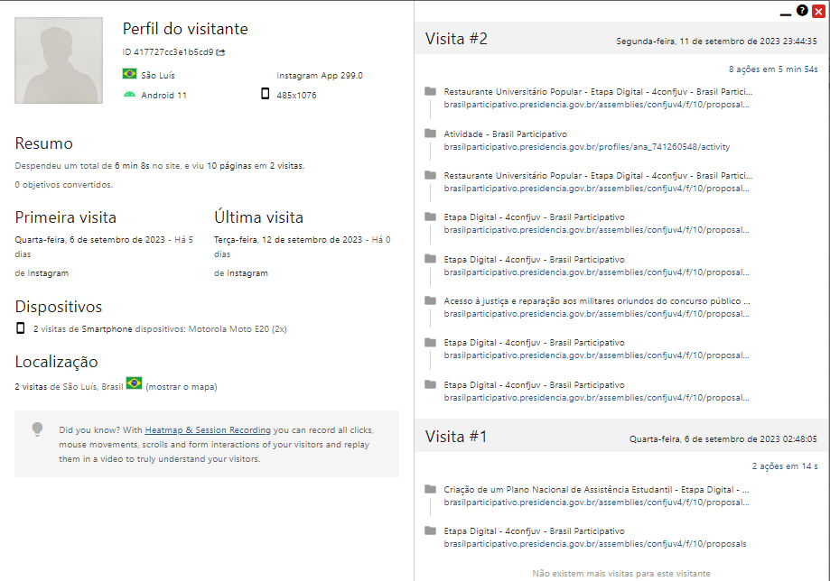
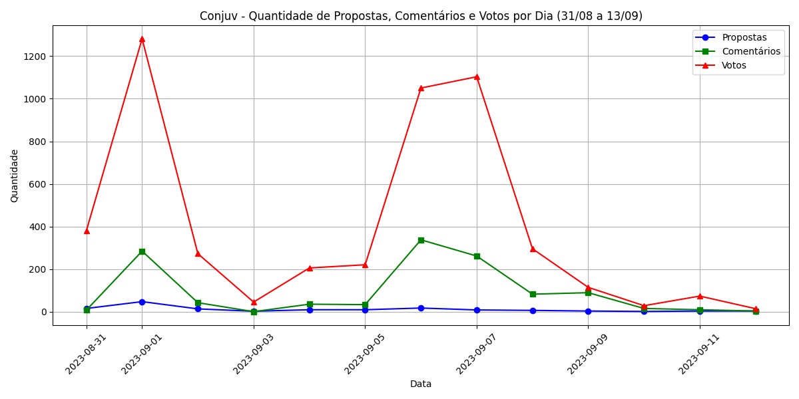
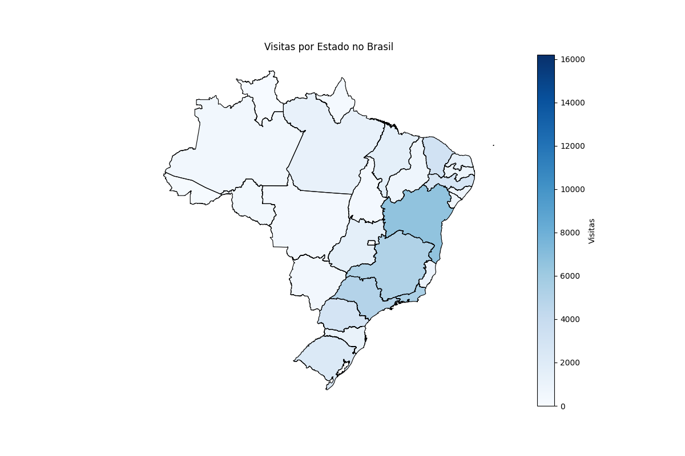

# 
Relatório Conjuv (31/08/2023 - 13/09/2023)

O presente relatório apresenta a participação digital da 4 Conferência Nacional da Juventude. Apresentamos os principais indicadores de acesso e participação, propostas, comentários e dinâmica na plataforma. O objetivo do relatório é guiar o ConJuv e organizadores da conferência nas estratégias de  mobilização, além de comunicar os indicadores da conferência.

# Sumário:
- [Relatório Conjuv (31/08/2023 - 13/09/2023)](#relatório-conjuv-31082023---13092023)
- [Sumário:](#sumário)
  - [*Dados Totais da Conjuv*](#dados-totais-da-conjuv)
  - [*Dados de Acesso*](#dados-de-acesso)
    - [**Perfil do visitante**](#perfil-do-visitante)
    - [*Qtd de Propostas, Votos e Comentários até 13/08*](#qtd-de-propostas-votos-e-comentários-até-1308)
    - [**Mapa de como a Qtd de Acessos por UF**](#mapa-de-como-a-qtd-de-acessos-por-uf)
  - [*TOP 20 Propostas por Voto no Geral*](#top-20-propostas-por-voto-no-geral)
  - [*Análise Qualitativa das Propostas*](#análise-qualitativa-das-propostas)
  - [*Ranking por Tópicos*](#ranking-por-tópicos)
## *Dados Totais da Conjuv*
|   Número Total de Propostas |   Número Total de Votos |   Total de Comentários |
|----------------------------:|------------------------:|-----------------------:|
|                         152 |                    5099 |                   1210 |

## *Dados de Acesso*

Os dados de acesso são referentes à visitação da página da conferência. Um indicador da mobilização realizada, mas principalmente sobre o comportamento do usuário padrão na plataforma (quanto tempo permanecem no contexto da conferencia digital). Vale observar que a taxa de abandono está em 48%. Isso significa que o usuário acessa a plataforma, mas não realiza qualquer ação na mesma. 

Essas métricas auxiliam os organizadores da conferência a verificar se a quantidade de acesso na plataforma está de acordo com o previsto. Essas métricas também guiam a revisita das estratégias de mobilização e de comunicação na plataforma.

|   Visualizações únicas de páginas |   Visualizações de páginas |   Tempo médio na página (segundos) |   Taxa de ressalto |
|----------------------------------:|---------------------------:|-----------------------------------:|-------------------:|
|                             15090 |                      25898 |                               82.5 |               0.48 |

### **Perfil do visitante**

Abaixo, tem uma imagem do comportamento real de um usuário típico. Temos que a maioria dos usuários fazendo e comenantando as propostas utilizam celulares, e as pessoas que passam mais tempo na plataformna (normalmente cadastrando conferencias regionais) utilizam o computador para acessar a plataforma. 

Nos próximos relatórios traremos mais detalhes desse uso e dos fluxos realizados pelos usuários.

  

### *Qtd de Propostas, Votos e Comentários até 13/08*

Esse gráfico monstra o comportamento da quantidade total de Propostas, Votos e comentários desde o inicio da 4 Conjuv até o dia 13/08.

  

### **Mapa de como a Qtd de Acessos por UF**

Esse mapa explica a quantidade de acessos por Unidade Federativa do Brasil, durante o periodo do relatório.

  

## *TOP 20 Propostas por Voto no Geral*

As top 20 propostas mais votadas evidenciam as propostas com maior mobilização e maior interesse do jovem participante. Vale observar também o número de comentários por propostas.

|    ID | Propostas                                                                                                                                                                                                                                      | Temas                                                                               |   Nº de Votos |   Nº de Comentários |
|------:|:-----------------------------------------------------------------------------------------------------------------------------------------------------------------------------------------------------------------------------------------------|:------------------------------------------------------------------------------------|--------------:|--------------------:|
| 11773 | [Casa da juventude](http://brasilparticipativo.presidencia.gov.br/assemblies/confjuv4/f/10/proposals/11773)                                                                                                                                    | XII - Sistema Nacional de Juventude - SINAJUVE                                      |           845 |                 136 |
| 11766 | [Acesso à justiça e reparação aos militares oriundos do concurso público da Aeronáutica e Fuzileiros Navais oriundos do concurso público da Marinha ](http://brasilparticipativo.presidencia.gov.br/assemblies/confjuv4/f/10/proposals/11766)  | XI - Direito à Segurança Pública e ao Acesso à Justiça                              |           709 |                  96 |
| 11681 | [Acesso à Cultura](http://brasilparticipativo.presidencia.gov.br/assemblies/confjuv4/f/10/proposals/11681)                                                                                                                                     | VI - Direito à Cultura                                                              |           241 |                  56 |
| 11659 | [A Ciência, Tecnologia e Inovação como ferramenta de Ascenção da Juventude brasileira](http://brasilparticipativo.presidencia.gov.br/assemblies/confjuv4/f/10/proposals/11659)                                                                 | III - Direito à Profissionalização, ao Trabalho e à Renda                           |           230 |                  16 |
| 11778 | [Plano Nacional de Prevenção à Letalidade Juvenil](http://brasilparticipativo.presidencia.gov.br/assemblies/confjuv4/f/10/proposals/11778)                                                                                                     | XI - Direito à Segurança Pública e ao Acesso à Justiça                              |           131 |                  49 |
| 11769 | [Implementação de políticas de inserção ao mercado de trabalho para Jovens da comunidade  LGBTQIAPN+](http://brasilparticipativo.presidencia.gov.br/assemblies/confjuv4/f/10/proposals/11769)                                                  | IV - Direito à Diversidade e à Igualdade                                            |           106 |                  73 |
| 11643 | [Criação de um Plano Nacional de Assistência Estudantil ](http://brasilparticipativo.presidencia.gov.br/assemblies/confjuv4/f/10/proposals/11643)                                                                                              | II - Direito à Educação                                                             |            94 |                   0 |
| 11767 | [Juventudes na Formulação de Políticas Públicas: criar canais de participação online](http://brasilparticipativo.presidencia.gov.br/assemblies/confjuv4/f/10/proposals/11767)                                                                  | I - Direito à Cidadania, à Participação Social e Política e à Representação Juvenil |            91 |                  46 |
| 11713 | [Que o tempo dos jovens na pós-graduação seja considerado como tempo de serviço e que crie um banco nacional para direcionar ao seu primeiro emprego.](http://brasilparticipativo.presidencia.gov.br/assemblies/confjuv4/f/10/proposals/11713) | III - Direito à Profissionalização, ao Trabalho e à Renda                           |            86 |                   5 |
| 11780 | [Criação da Política Nacional de Cultura para as Juventudes do Brasil](http://brasilparticipativo.presidencia.gov.br/assemblies/confjuv4/f/10/proposals/11780)                                                                                 | VI - Direito à Cultura                                                              |            68 |                  26 |
| 11668 | [Obrigar a Disseminação do Conteúdo do Estatuto da Juventude. ](http://brasilparticipativo.presidencia.gov.br/assemblies/confjuv4/f/10/proposals/11668)                                                                                        | I - Direito à Cidadania, à Participação Social e Política e à Representação Juvenil |            66 |                  86 |
| 11788 | [ID JOVEM nas Alturas: Inclusão das Companhias Aéreas](http://brasilparticipativo.presidencia.gov.br/assemblies/confjuv4/f/10/proposals/11788)                                                                                                 | I - Direito à Cidadania, à Participação Social e Política e à Representação Juvenil |            61 |                  63 |
| 11680 | [Disseminação do esporte e lazer para juventude nas comunidades](http://brasilparticipativo.presidencia.gov.br/assemblies/confjuv4/f/10/proposals/11680)                                                                                       | VIII - Direito ao Desporto e ao Lazer                                               |            60 |                  88 |
| 11735 | [InovaJovem: Democratizando o Acesso à Tecnologia e Inovação para a Juventude](http://brasilparticipativo.presidencia.gov.br/assemblies/confjuv4/f/10/proposals/11735)                                                                         | II - Direito à Educação                                                             |            56 |                  24 |
| 11734 | [Garantindo o Futuro dos Bolsistas do ProUni: Uma Política de Reformulação, Permanência e Conclusão.](http://brasilparticipativo.presidencia.gov.br/assemblies/confjuv4/f/10/proposals/11734)                                                  | II - Direito à Educação                                                             |            55 |                  25 |
| 11736 | [Leis de incentivo e editais para juventudes de terreiro e de comunidades tradicionais ](http://brasilparticipativo.presidencia.gov.br/assemblies/confjuv4/f/10/proposals/11736)                                                               | IV - Direito à Diversidade e à Igualdade                                            |            53 |                   0 |
| 11795 | [Restaurante Universitário Popular](http://brasilparticipativo.presidencia.gov.br/assemblies/confjuv4/f/10/proposals/11795)                                                                                                                    | II - Direito à Educação                                                             |            52 |                   0 |
| 11645 | [A Juventude de Candomblé e a luta por direitos. ](http://brasilparticipativo.presidencia.gov.br/assemblies/confjuv4/f/10/proposals/11645)                                                                                                     | IV - Direito à Diversidade e à Igualdade                                            |            52 |                   1 |
| 11700 | [Clubes da Juventude](http://brasilparticipativo.presidencia.gov.br/assemblies/confjuv4/f/10/proposals/11700)                                                                                                                                  | I - Direito à Cidadania, à Participação Social e Política e à Representação Juvenil |            51 |                   4 |
| 11784 | [Desenvolvimento tecnologico e social para todos!](http://brasilparticipativo.presidencia.gov.br/assemblies/confjuv4/f/10/proposals/11784)                                                                                                     | II - Direito à Educação                                                             |            47 |                   4 |

## *Análise Qualitativa das Propostas* 
 Os temas com o maior número de propostas são: 
|    | Temas                                                                               |   Nº de Propostas |   Nº de Votos |   Nº de Comentários |
|---:|:------------------------------------------------------------------------------------|------------------:|--------------:|--------------------:|
|  0 | I - Direito à Cidadania, à Participação Social e Política e à Representação Juvenil |                29 |           656 |                 254 |
|  1 | II - Direito à Educação                                                             |                28 |           627 |                 154 |
|  2 | III - Direito à Profissionalização, ao Trabalho e à Renda                           |                27 |           721 |                 101 |
|  3 | IV - Direito à Diversidade e à Igualdade                                            |                13 |           350 |                  83 |
|  4 | IX - Direito à Sustentabilidade e ao Meio Ambiente                                  |                 4 |            34 |                   1 |
|  5 | V - Direito à Saúde                                                                 |                10 |           136 |                  76 |
|  6 | VI - Direito à Cultura                                                              |                 6 |           349 |                  83 |
|  7 | VII - Direito à Comunicação e à Liberdade de Expressão                              |                 5 |            67 |                  10 |
|  8 | VIII - Direito ao Desporto e ao Lazer                                               |                 6 |           152 |                  97 |
|  9 | X - Direito ao Território e à Mobilidade                                            |                 6 |            88 |                  42 |
| 10 | XI - Direito à Segurança Pública e ao Acesso à Justiça                              |                 9 |           955 |                 157 |
| 11 | XII - Sistema Nacional de Juventude - SINAJUVE                                      |                 5 |           901 |                 140 |
- De 152 propostas atuais, apenas 2 delas apresentam votação acima de 300;
- 111 propostas estão com menos de 20 votos (73.03% do total de propostas);
## *Ranking por Tópicos*
| Tópico 1                                    |   Qtd Propostas | Tópico 2                     |   Qtd Propostas |
|:--------------------------------------------|----------------:|:-----------------------------|----------------:|
|                                             |            8418 |                              |            8418 |
| Juventude                                   |               8 | Direitos da juventude        |               6 |
| Jovens                                      |               3 | Juventude                    |               3 |
| Igualdade de gênero                         |               2 | Jovens                       |               3 |
| Políticas públicas                          |               2 | Igualdade de oportunidades   |               3 |
| Acessibilidade para pessoas com deficiência |               2 | Mercado do trabalho          |               2 |
| Saúde mental                                |               2 | Inteligência artificial      |               2 |
| Jovem                                       |               2 | Comunicação                  |               2 |
| Pesquisa                                    |               2 | Educação de jovens e adultos |               2 |
| Mercado de trabalho                         |               2 | Meio ambiente                |               1 |