# Relatório de Análise de Dados
## Resultados da Análise

### Propostas Categorizadas Manualmente

  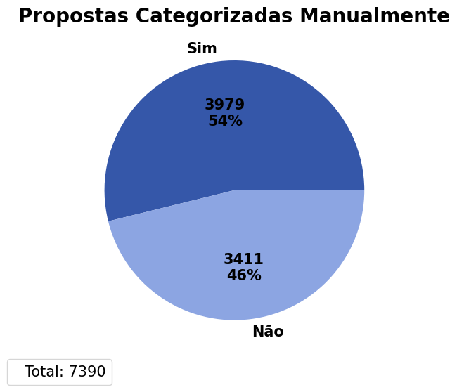

  <i>Gráfico 1: Propostas Categorizadas Manualmente</i>

No Gráfico 1, é possível visualizar a distribuição das propostas categorizadas manualmente.

### Quantidade de Propostas por Ministério

  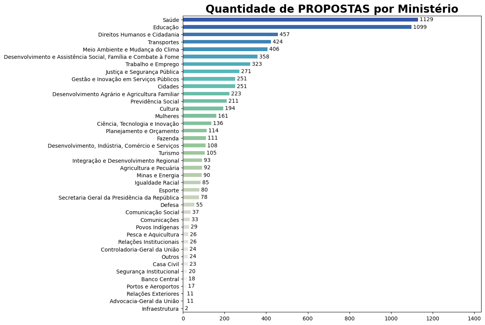

  <i>Gráfico 2: Quantidade de Propostas por Ministério</i>

No Gráfico 2, é possível visualizar a quantidade de propostas por ministério, apresentando os ministérios com mais propostas.

### Quantidade de Votos por Ministério

  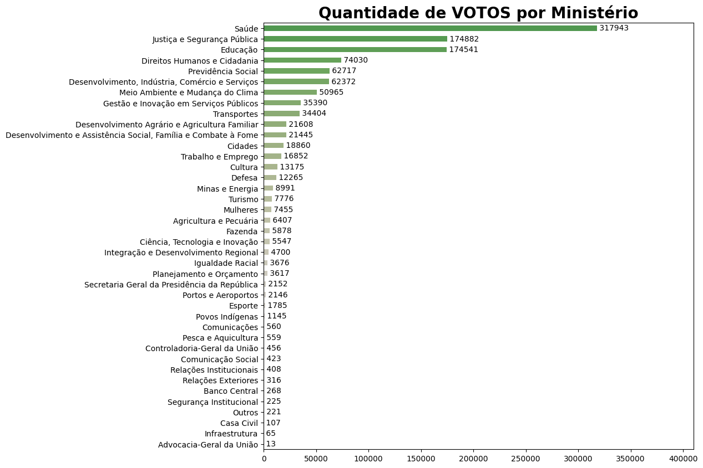

  <i>Gráfico 3: Quantidade de Votos por Ministério</i>

No Gráfico 3, é possível visualizar a quantidade de votos por ministério, apresentando os ministérios com mais votos em propostas.

### Quantidade de Votos por Categoria

  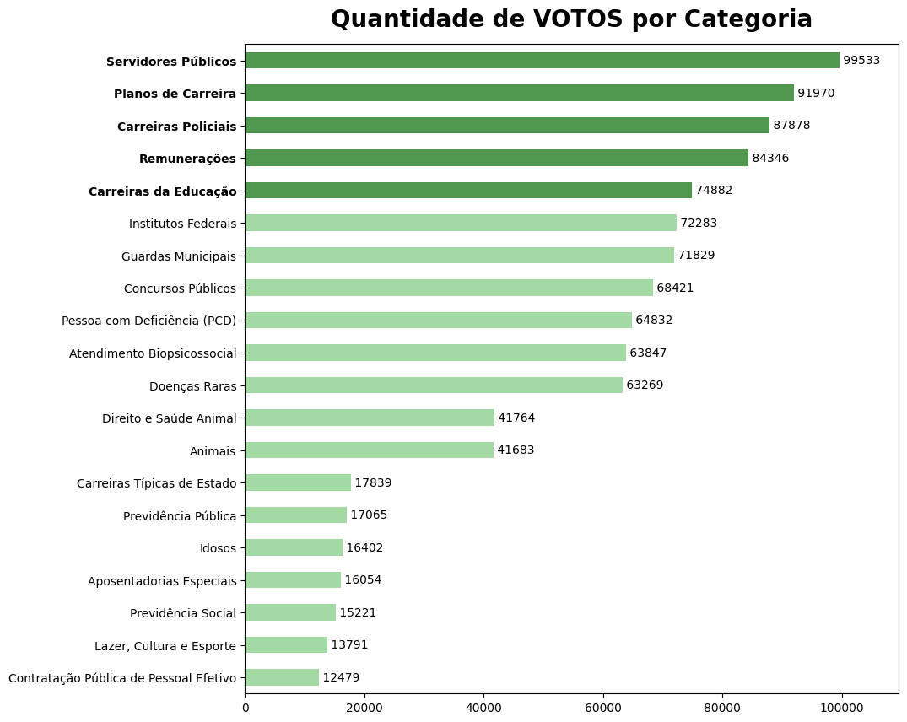

  <i>Gráfico 4: Quantidade de Votos por Categoria</i>

No Gráfico 4, é possível visualizar a quantidade de votos por categoria, apresentando as categorias com mais votos.

### Quantidade de Propostas por Categoria

  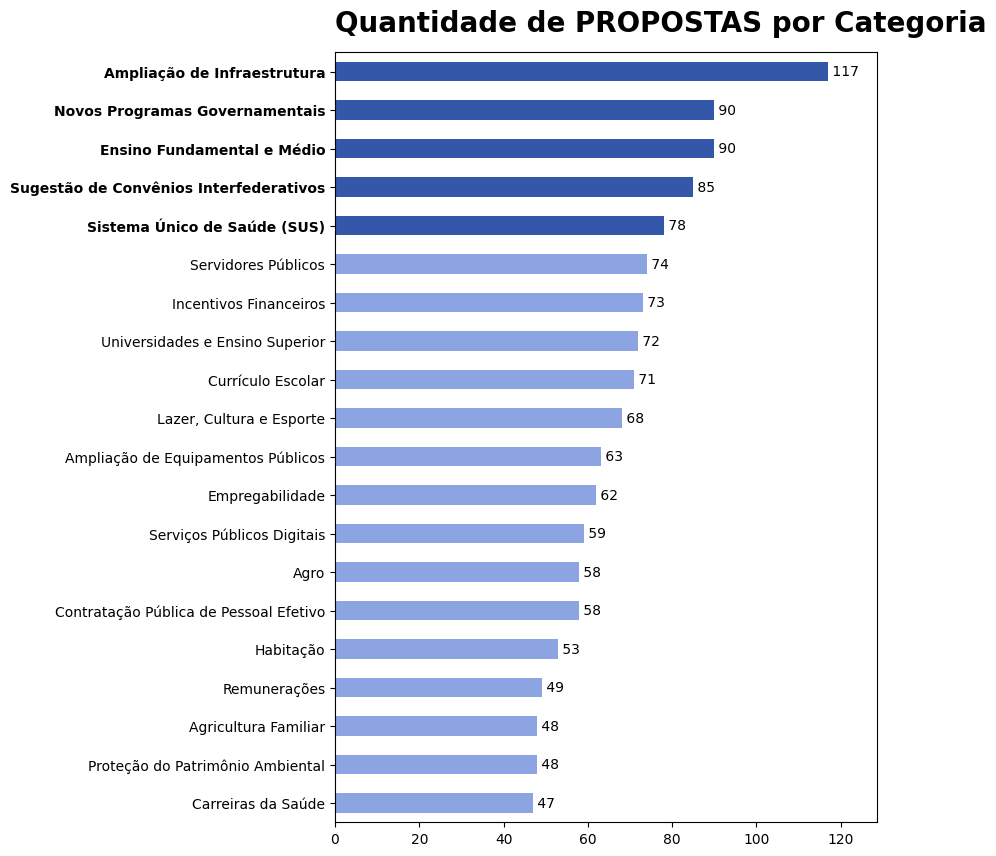

  <i>Gráfico 5: Quantidade de Propostas por Categoria</i>

No Gráfico 5, é possível visualizar a quantidade de propostas por categoria, apresentando as categorias com mais propostas.

### Ciência, Tecnologia e Inovação - Propostas Categorizadas Manualmente

  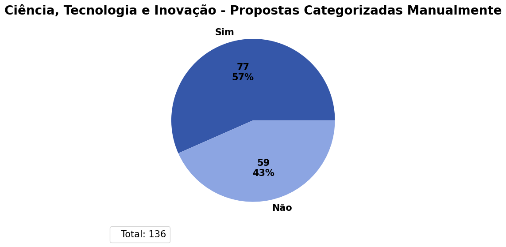

  <i>Gráfico 6: Ciência, Tecnologia e Inovação - Propostas Categorizadas Manualmente</i>

Este gráfico de pizza mostra a proporção de propostas categorizadas manualmente para o ministério Ciência, Tecnologia e Inovação, indicando quantas foram categorizadas e quantas não foram.

### Saúde - Propostas Categorizadas Manualmente

  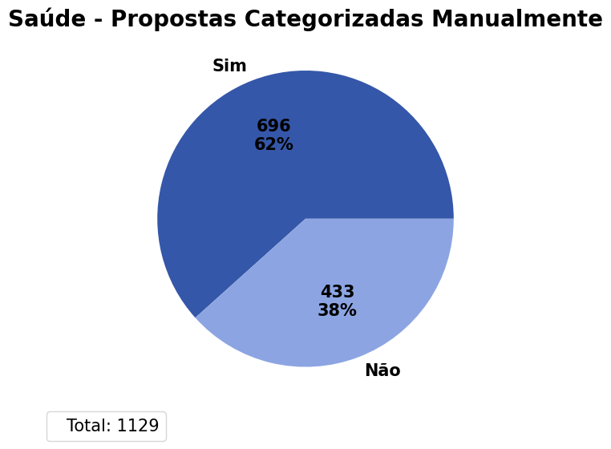

  <i>Gráfico 7: Saúde - Propostas Categorizadas Manualmente</i>

Este gráfico de pizza mostra a proporção de propostas categorizadas manualmente para o ministério Saúde, indicando quantas foram categorizadas e quantas não foram.

### Desenvolvimento e Assistência Social, Família e Combate à Fome - Propostas Categorizadas Manualmente

  

  <i>Gráfico 8: Desenvolvimento e Assistência Social, Família e Combate à Fome - Propostas Categorizadas Manualmente</i>

Este gráfico de pizza mostra a proporção de propostas categorizadas manualmente para o ministério Desenvolvimento e Assistência Social, Família e Combate à Fome, indicando quantas foram categorizadas e quantas não foram.

### Comunicações - Propostas Categorizadas Manualmente

  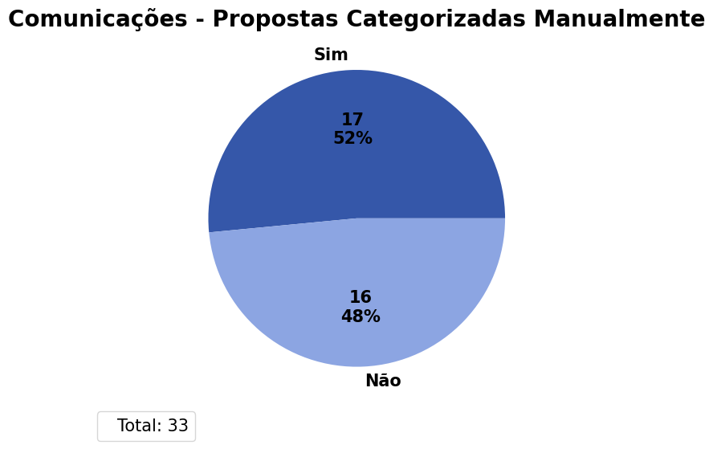

  <i>Gráfico 9: Comunicações - Propostas Categorizadas Manualmente</i>

Este gráfico de pizza mostra a proporção de propostas categorizadas manualmente para o ministério Comunicações, indicando quantas foram categorizadas e quantas não foram.

### Agricultura e Pecuária - Propostas Categorizadas Manualmente

  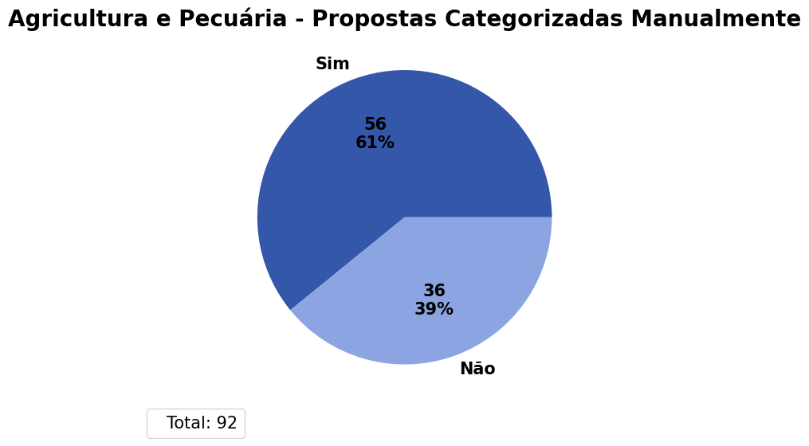

  <i>Gráfico 10: Agricultura e Pecuária - Propostas Categorizadas Manualmente</i>

Este gráfico de pizza mostra a proporção de propostas categorizadas manualmente para o ministério Agricultura e Pecuária, indicando quantas foram categorizadas e quantas não foram.

### Educação - Propostas Categorizadas Manualmente

  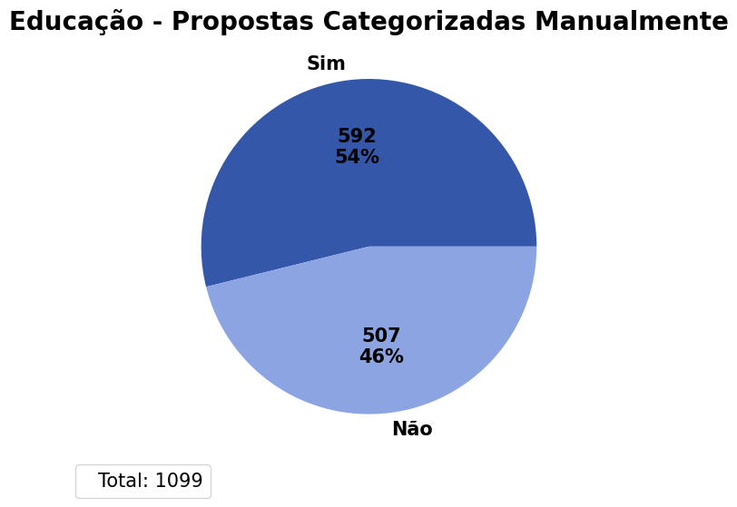

  <i>Gráfico 11: Educação - Propostas Categorizadas Manualmente</i>

Este gráfico de pizza mostra a proporção de propostas categorizadas manualmente para o ministério Educação, indicando quantas foram categorizadas e quantas não foram.

### Integração e Desenvolvimento Regional - Propostas Categorizadas Manualmente

  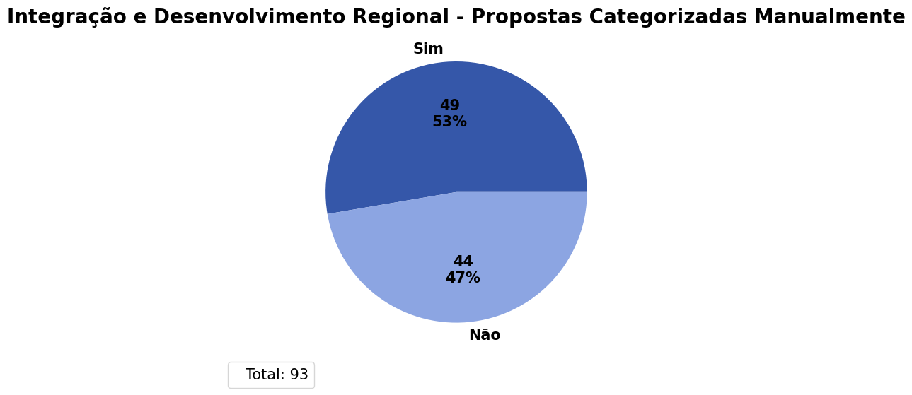

  <i>Gráfico 12: Integração e Desenvolvimento Regional - Propostas Categorizadas Manualmente</i>

Este gráfico de pizza mostra a proporção de propostas categorizadas manualmente para o ministério Integração e Desenvolvimento Regional, indicando quantas foram categorizadas e quantas não foram.

### Desenvolvimento Agrário e Agricultura Familiar - Propostas Categorizadas Manualmente

  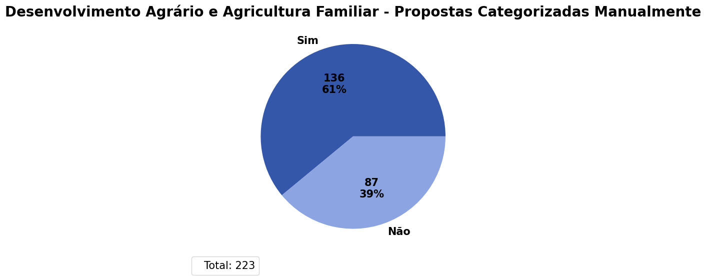

  <i>Gráfico 13: Desenvolvimento Agrário e Agricultura Familiar - Propostas Categorizadas Manualmente</i>

Este gráfico de pizza mostra a proporção de propostas categorizadas manualmente para o ministério Desenvolvimento Agrário e Agricultura Familiar, indicando quantas foram categorizadas e quantas não foram.

### Direitos Humanos e Cidadania - Propostas Categorizadas Manualmente

  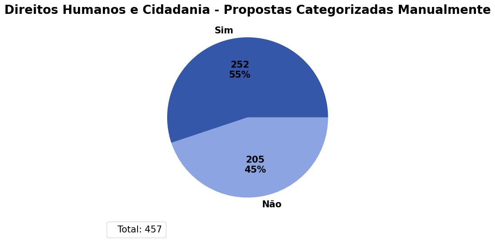

  <i>Gráfico 14: Direitos Humanos e Cidadania - Propostas Categorizadas Manualmente</i>

Este gráfico de pizza mostra a proporção de propostas categorizadas manualmente para o ministério Direitos Humanos e Cidadania, indicando quantas foram categorizadas e quantas não foram.

### Gestão e Inovação em Serviços Públicos - Propostas Categorizadas Manualmente

  

  <i>Gráfico 15: Gestão e Inovação em Serviços Públicos - Propostas Categorizadas Manualmente</i>

Este gráfico de pizza mostra a proporção de propostas categorizadas manualmente para o ministério Gestão e Inovação em Serviços Públicos, indicando quantas foram categorizadas e quantas não foram.

### Justiça e Segurança Pública - Propostas Categorizadas Manualmente

  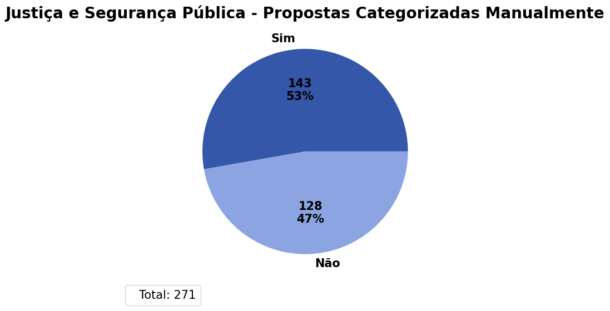

  <i>Gráfico 16: Justiça e Segurança Pública - Propostas Categorizadas Manualmente</i>

Este gráfico de pizza mostra a proporção de propostas categorizadas manualmente para o ministério Justiça e Segurança Pública, indicando quantas foram categorizadas e quantas não foram.

### Banco Central - Propostas Categorizadas Manualmente

  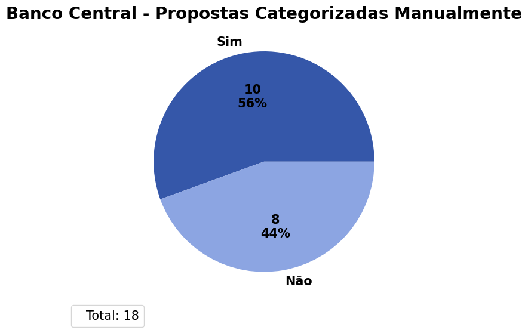

  <i>Gráfico 17: Banco Central - Propostas Categorizadas Manualmente</i>

Este gráfico de pizza mostra a proporção de propostas categorizadas manualmente para o ministério Banco Central, indicando quantas foram categorizadas e quantas não foram.

### Meio Ambiente e Mudança do Clima - Propostas Categorizadas Manualmente

  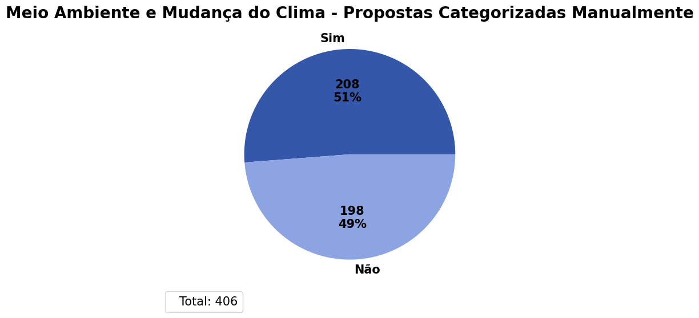

  <i>Gráfico 18: Meio Ambiente e Mudança do Clima - Propostas Categorizadas Manualmente</i>

Este gráfico de pizza mostra a proporção de propostas categorizadas manualmente para o ministério Meio Ambiente e Mudança do Clima, indicando quantas foram categorizadas e quantas não foram.

### Turismo - Propostas Categorizadas Manualmente

  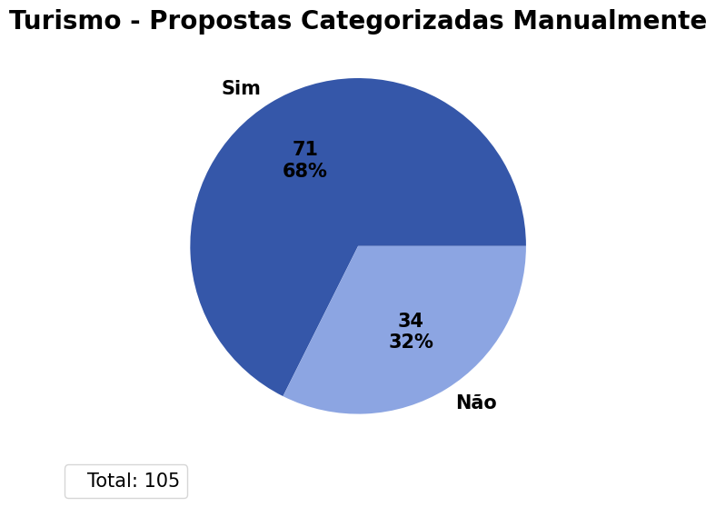

  <i>Gráfico 19: Turismo - Propostas Categorizadas Manualmente</i>

Este gráfico de pizza mostra a proporção de propostas categorizadas manualmente para o ministério Turismo, indicando quantas foram categorizadas e quantas não foram.

### Mulheres - Propostas Categorizadas Manualmente

  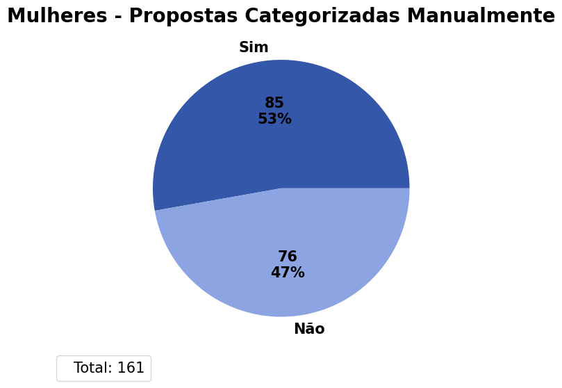

  <i>Gráfico 20: Mulheres - Propostas Categorizadas Manualmente</i>

Este gráfico de pizza mostra a proporção de propostas categorizadas manualmente para o ministério Mulheres, indicando quantas foram categorizadas e quantas não foram.

### Trabalho e Emprego - Propostas Categorizadas Manualmente

  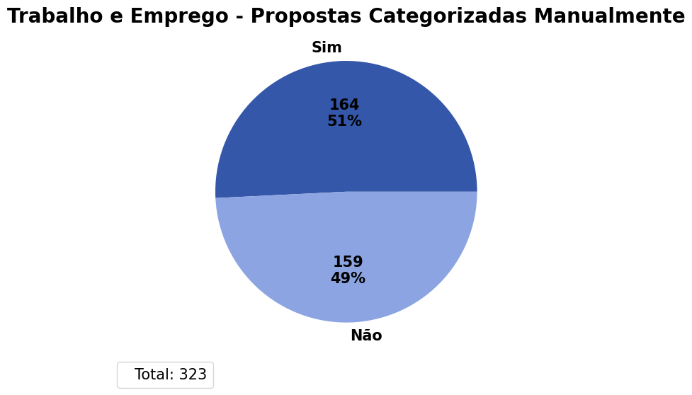

  <i>Gráfico 21: Trabalho e Emprego - Propostas Categorizadas Manualmente</i>

Este gráfico de pizza mostra a proporção de propostas categorizadas manualmente para o ministério Trabalho e Emprego, indicando quantas foram categorizadas e quantas não foram.

### Secretaria Geral da Presidência da República - Propostas Categorizadas Manualmente

  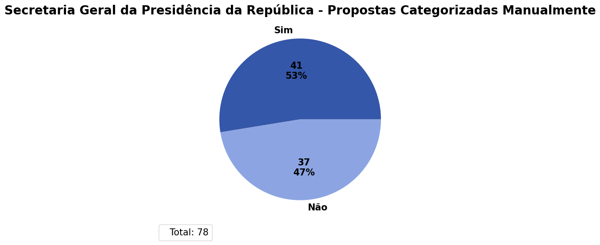

  <i>Gráfico 22: Secretaria Geral da Presidência da República - Propostas Categorizadas Manualmente</i>

Este gráfico de pizza mostra a proporção de propostas categorizadas manualmente para o ministério Secretaria Geral da Presidência da República, indicando quantas foram categorizadas e quantas não foram.

### Previdência Social - Propostas Categorizadas Manualmente

  

  <i>Gráfico 23: Previdência Social - Propostas Categorizadas Manualmente</i>

Este gráfico de pizza mostra a proporção de propostas categorizadas manualmente para o ministério Previdência Social, indicando quantas foram categorizadas e quantas não foram.

### Casa Civil - Propostas Categorizadas Manualmente

  

  <i>Gráfico 24: Casa Civil - Propostas Categorizadas Manualmente</i>

Este gráfico de pizza mostra a proporção de propostas categorizadas manualmente para o ministério Casa Civil, indicando quantas foram categorizadas e quantas não foram.

### Cidades - Propostas Categorizadas Manualmente

  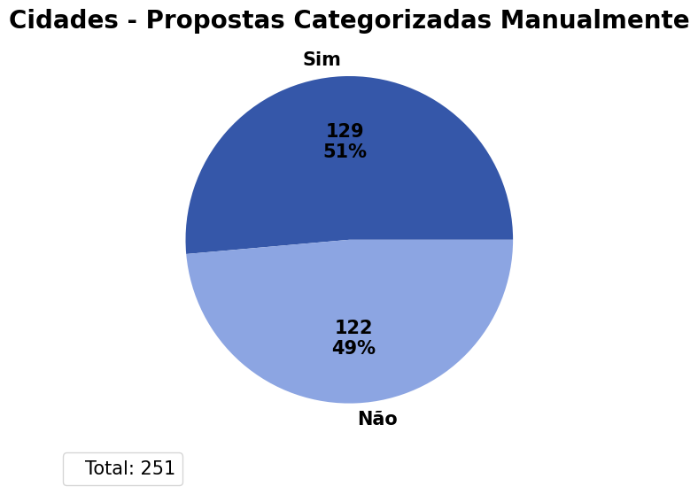

  <i>Gráfico 25: Cidades - Propostas Categorizadas Manualmente</i>

Este gráfico de pizza mostra a proporção de propostas categorizadas manualmente para o ministério Cidades, indicando quantas foram categorizadas e quantas não foram.

### Igualdade Racial - Propostas Categorizadas Manualmente

  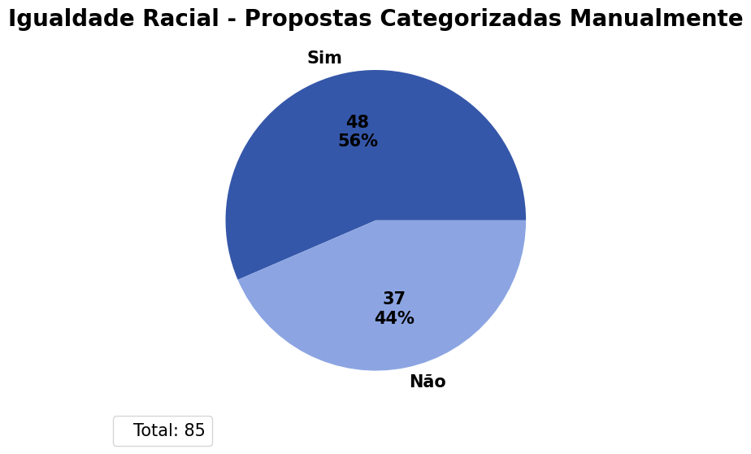

  <i>Gráfico 26: Igualdade Racial - Propostas Categorizadas Manualmente</i>

Este gráfico de pizza mostra a proporção de propostas categorizadas manualmente para o ministério Igualdade Racial, indicando quantas foram categorizadas e quantas não foram.

### Desenvolvimento, Indústria, Comércio e Serviços - Propostas Categorizadas Manualmente

  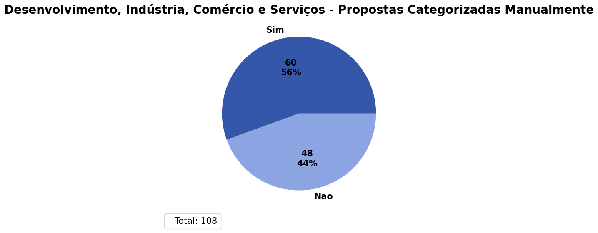

  <i>Gráfico 27: Desenvolvimento, Indústria, Comércio e Serviços - Propostas Categorizadas Manualmente</i>

Este gráfico de pizza mostra a proporção de propostas categorizadas manualmente para o ministério Desenvolvimento, Indústria, Comércio e Serviços, indicando quantas foram categorizadas e quantas não foram.

### Povos Indígenas - Propostas Categorizadas Manualmente

  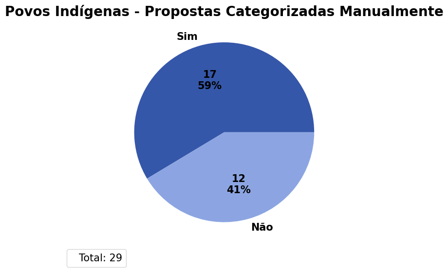

  <i>Gráfico 28: Povos Indígenas - Propostas Categorizadas Manualmente</i>

Este gráfico de pizza mostra a proporção de propostas categorizadas manualmente para o ministério Povos Indígenas, indicando quantas foram categorizadas e quantas não foram.

### Portos e Aeroportos - Propostas Categorizadas Manualmente

  

  <i>Gráfico 29: Portos e Aeroportos - Propostas Categorizadas Manualmente</i>

Este gráfico de pizza mostra a proporção de propostas categorizadas manualmente para o ministério Portos e Aeroportos, indicando quantas foram categorizadas e quantas não foram.

### Transportes - Propostas Categorizadas Manualmente

  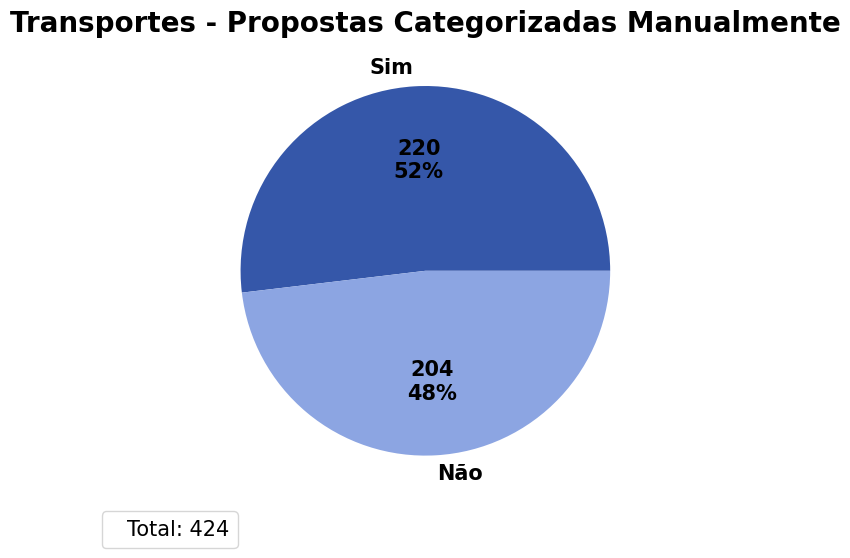

  <i>Gráfico 30: Transportes - Propostas Categorizadas Manualmente</i>

Este gráfico de pizza mostra a proporção de propostas categorizadas manualmente para o ministério Transportes, indicando quantas foram categorizadas e quantas não foram.

### Cultura - Propostas Categorizadas Manualmente

  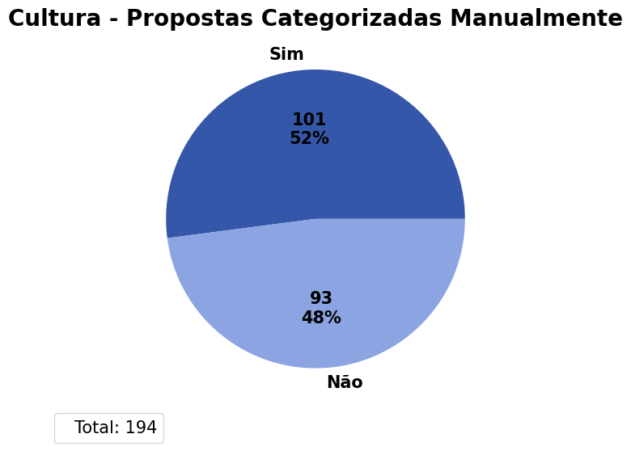

  <i>Gráfico 31: Cultura - Propostas Categorizadas Manualmente</i>

Este gráfico de pizza mostra a proporção de propostas categorizadas manualmente para o ministério Cultura, indicando quantas foram categorizadas e quantas não foram.

### Minas e Energia - Propostas Categorizadas Manualmente

  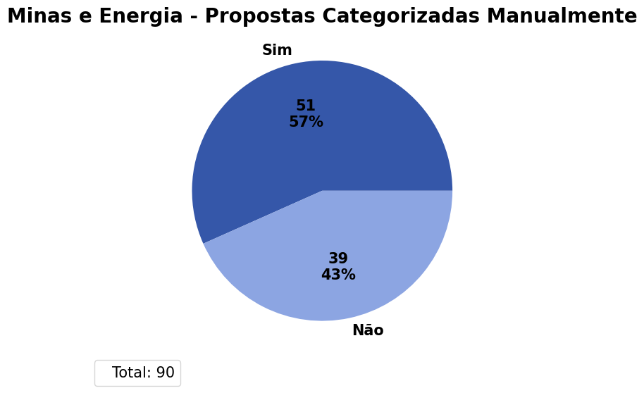

  <i>Gráfico 32: Minas e Energia - Propostas Categorizadas Manualmente</i>

Este gráfico de pizza mostra a proporção de propostas categorizadas manualmente para o ministério Minas e Energia, indicando quantas foram categorizadas e quantas não foram.

### Controladoria-Geral da União - Propostas Categorizadas Manualmente

  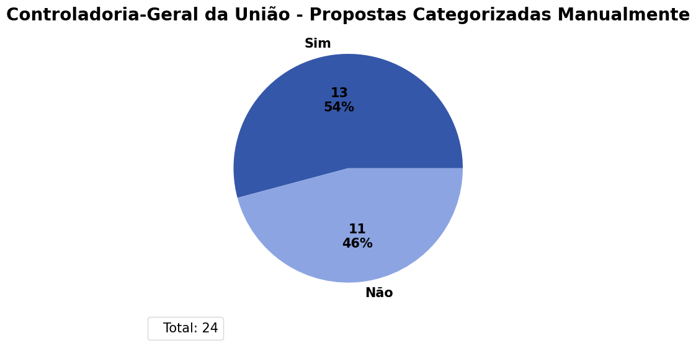

  <i>Gráfico 33: Controladoria-Geral da União - Propostas Categorizadas Manualmente</i>

Este gráfico de pizza mostra a proporção de propostas categorizadas manualmente para o ministério Controladoria-Geral da União, indicando quantas foram categorizadas e quantas não foram.

### Planejamento e Orçamento - Propostas Categorizadas Manualmente

  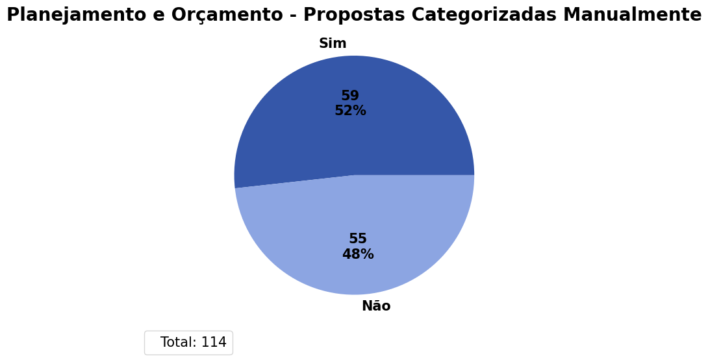

  <i>Gráfico 34: Planejamento e Orçamento - Propostas Categorizadas Manualmente</i>

Este gráfico de pizza mostra a proporção de propostas categorizadas manualmente para o ministério Planejamento e Orçamento, indicando quantas foram categorizadas e quantas não foram.

### Fazenda - Propostas Categorizadas Manualmente

  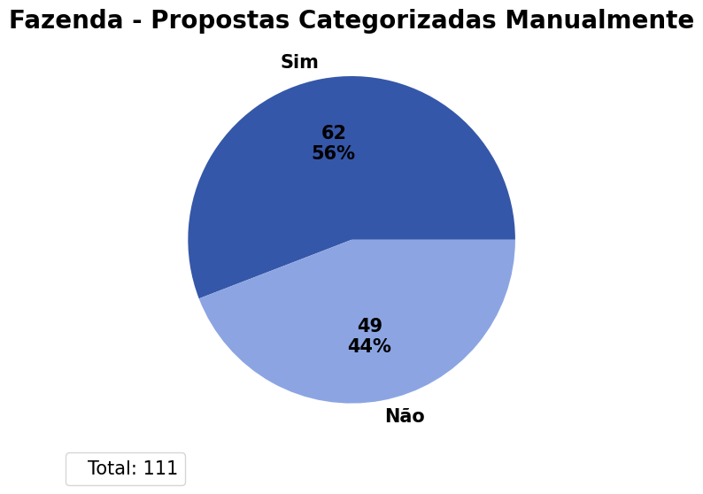

  <i>Gráfico 35: Fazenda - Propostas Categorizadas Manualmente</i>

Este gráfico de pizza mostra a proporção de propostas categorizadas manualmente para o ministério Fazenda, indicando quantas foram categorizadas e quantas não foram.

### Comunicação Social - Propostas Categorizadas Manualmente

  

  <i>Gráfico 36: Comunicação Social - Propostas Categorizadas Manualmente</i>

Este gráfico de pizza mostra a proporção de propostas categorizadas manualmente para o ministério Comunicação Social, indicando quantas foram categorizadas e quantas não foram.

### Esporte - Propostas Categorizadas Manualmente

  

  <i>Gráfico 37: Esporte - Propostas Categorizadas Manualmente</i>

Este gráfico de pizza mostra a proporção de propostas categorizadas manualmente para o ministério Esporte, indicando quantas foram categorizadas e quantas não foram.

### Pesca e Aquicultura - Propostas Categorizadas Manualmente

  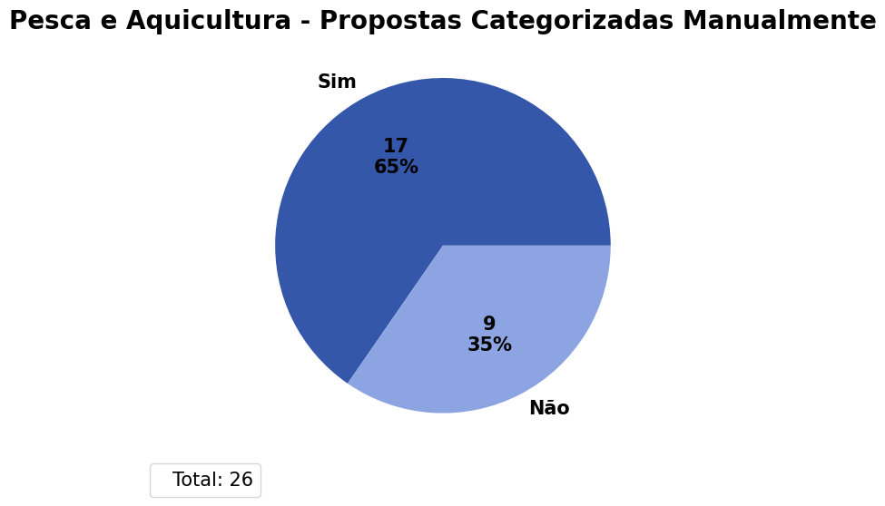

  <i>Gráfico 38: Pesca e Aquicultura - Propostas Categorizadas Manualmente</i>

Este gráfico de pizza mostra a proporção de propostas categorizadas manualmente para o ministério Pesca e Aquicultura, indicando quantas foram categorizadas e quantas não foram.

### Relações Exteriores - Propostas Categorizadas Manualmente

  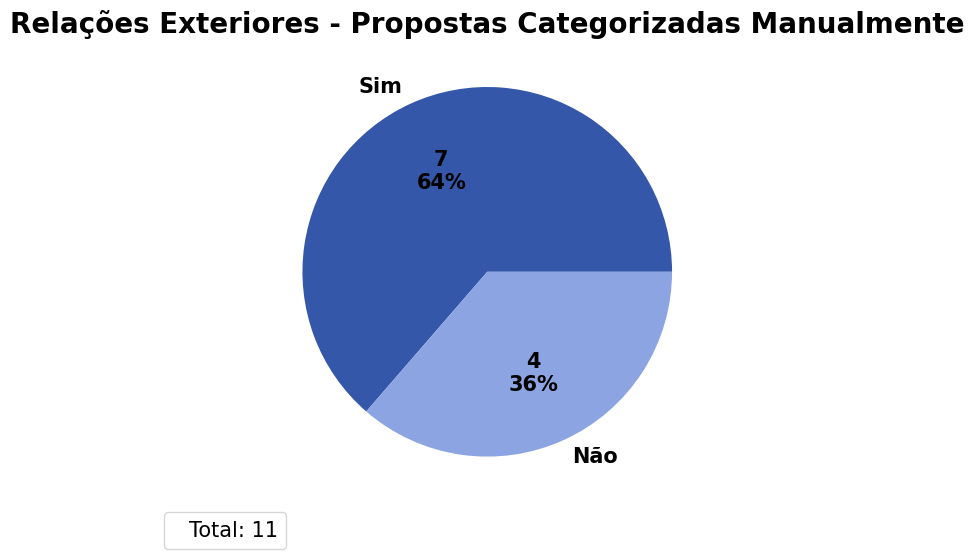

  <i>Gráfico 39: Relações Exteriores - Propostas Categorizadas Manualmente</i>

Este gráfico de pizza mostra a proporção de propostas categorizadas manualmente para o ministério Relações Exteriores, indicando quantas foram categorizadas e quantas não foram.

### Defesa - Propostas Categorizadas Manualmente

  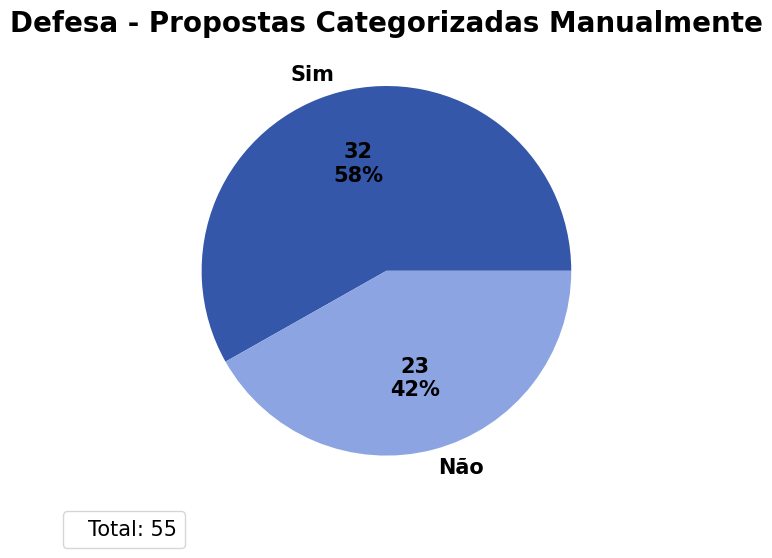

  <i>Gráfico 40: Defesa - Propostas Categorizadas Manualmente</i>

Este gráfico de pizza mostra a proporção de propostas categorizadas manualmente para o ministério Defesa, indicando quantas foram categorizadas e quantas não foram.

### Segurança Institucional - Propostas Categorizadas Manualmente

  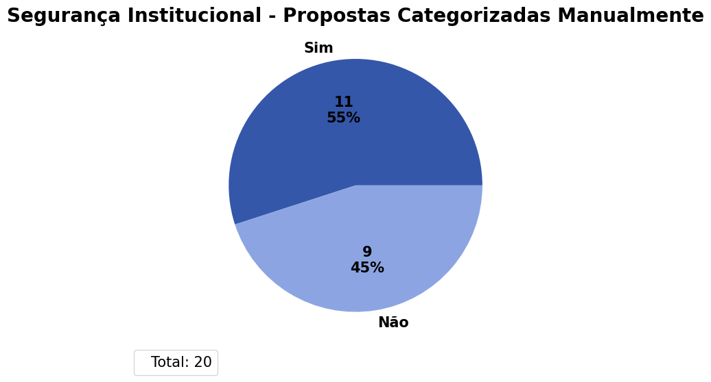

  <i>Gráfico 41: Segurança Institucional - Propostas Categorizadas Manualmente</i>

Este gráfico de pizza mostra a proporção de propostas categorizadas manualmente para o ministério Segurança Institucional, indicando quantas foram categorizadas e quantas não foram.

### Relações Institucionais - Propostas Categorizadas Manualmente

  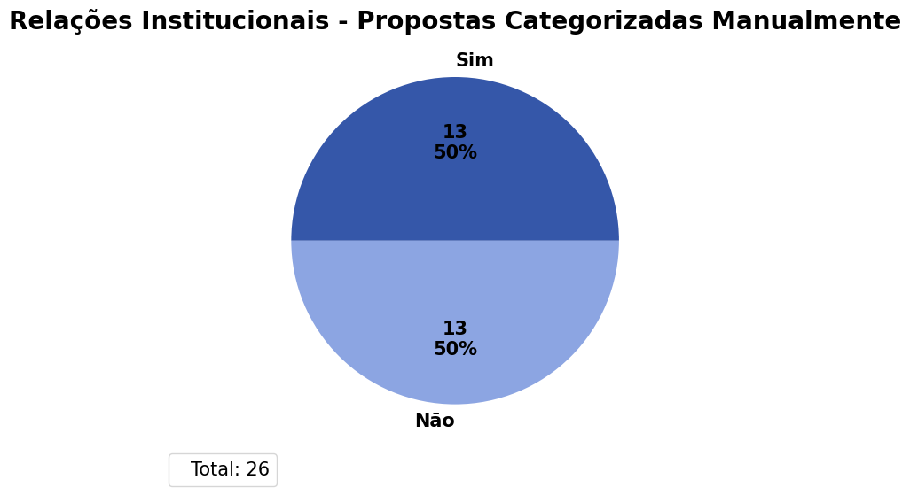

  <i>Gráfico 42: Relações Institucionais - Propostas Categorizadas Manualmente</i>

Este gráfico de pizza mostra a proporção de propostas categorizadas manualmente para o ministério Relações Institucionais, indicando quantas foram categorizadas e quantas não foram.

### Ciência, Tecnologia e Inovação - Quantidade de VOTOS por Categoria

  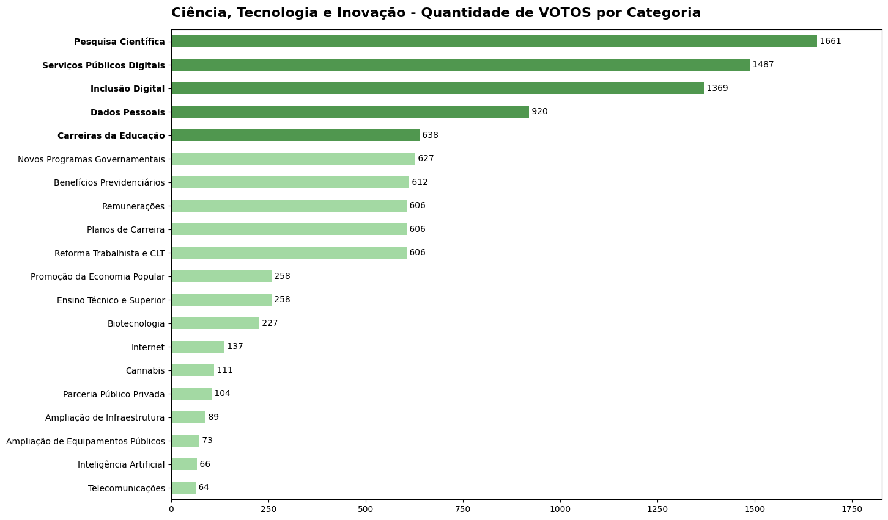

  <i>Gráfico 43: Ciência, Tecnologia e Inovação - Quantidade de VOTOS por Categoria</i>

Este gráfico de barras mostra a quantidade de votos por categoria para o ministério Ciência, Tecnologia e Inovação, exibindo as categorias com mais votos.

### Saúde - Quantidade de VOTOS por Categoria

  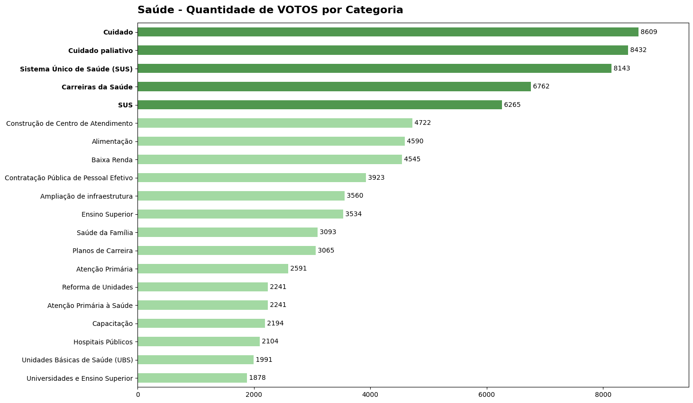

  <i>Gráfico 44: Saúde - Quantidade de VOTOS por Categoria</i>

Este gráfico de barras mostra a quantidade de votos por categoria para o ministério Saúde, exibindo as categorias com mais votos.

### Desenvolvimento e Assistência Social, Família e Combate à Fome - Quantidade de VOTOS por Categoria

  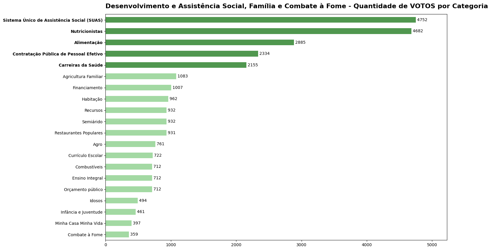

  <i>Gráfico 45: Desenvolvimento e Assistência Social, Família e Combate à Fome - Quantidade de VOTOS por Categoria</i>

Este gráfico de barras mostra a quantidade de votos por categoria para o ministério Desenvolvimento e Assistência Social, Família e Combate à Fome, exibindo as categorias com mais votos.

### Comunicações - Quantidade de VOTOS por Categoria

  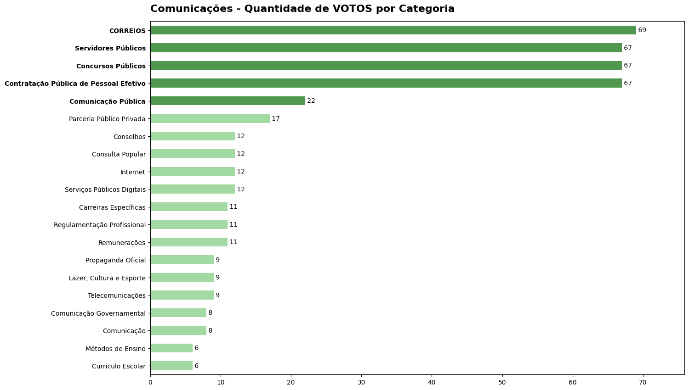

  <i>Gráfico 46: Comunicações - Quantidade de VOTOS por Categoria</i>

Este gráfico de barras mostra a quantidade de votos por categoria para o ministério Comunicações, exibindo as categorias com mais votos.

### Agricultura e Pecuária - Quantidade de VOTOS por Categoria

  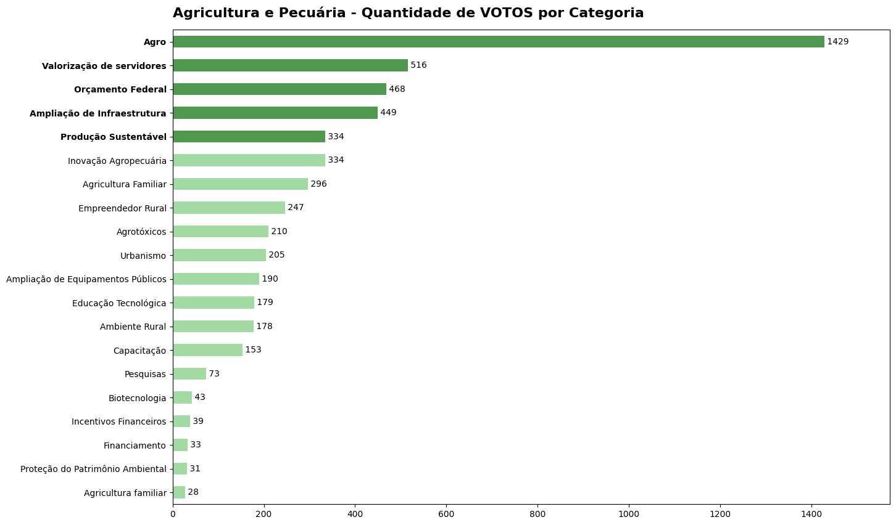

  <i>Gráfico 47: Agricultura e Pecuária - Quantidade de VOTOS por Categoria</i>

Este gráfico de barras mostra a quantidade de votos por categoria para o ministério Agricultura e Pecuária, exibindo as categorias com mais votos.

### Educação - Quantidade de VOTOS por Categoria

  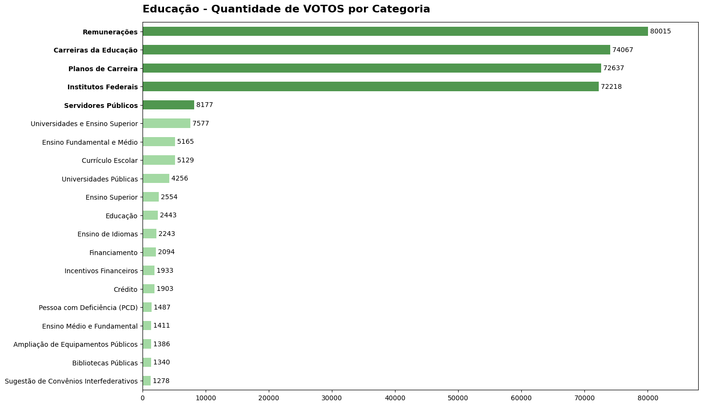

  <i>Gráfico 48: Educação - Quantidade de VOTOS por Categoria</i>

Este gráfico de barras mostra a quantidade de votos por categoria para o ministério Educação, exibindo as categorias com mais votos.

### Integração e Desenvolvimento Regional - Quantidade de VOTOS por Categoria

  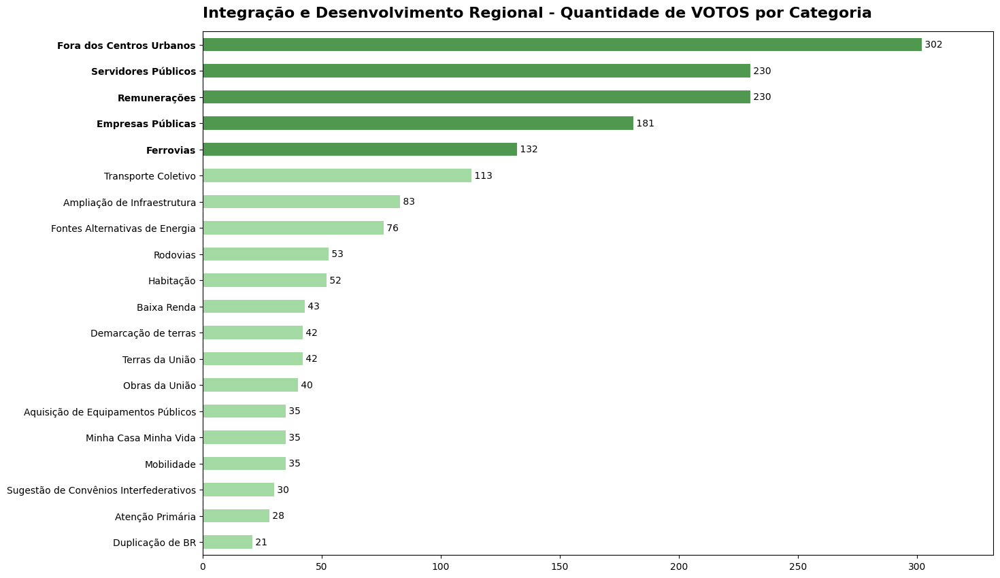

  <i>Gráfico 49: Integração e Desenvolvimento Regional - Quantidade de VOTOS por Categoria</i>

Este gráfico de barras mostra a quantidade de votos por categoria para o ministério Integração e Desenvolvimento Regional, exibindo as categorias com mais votos.

### Desenvolvimento Agrário e Agricultura Familiar - Quantidade de VOTOS por Categoria

  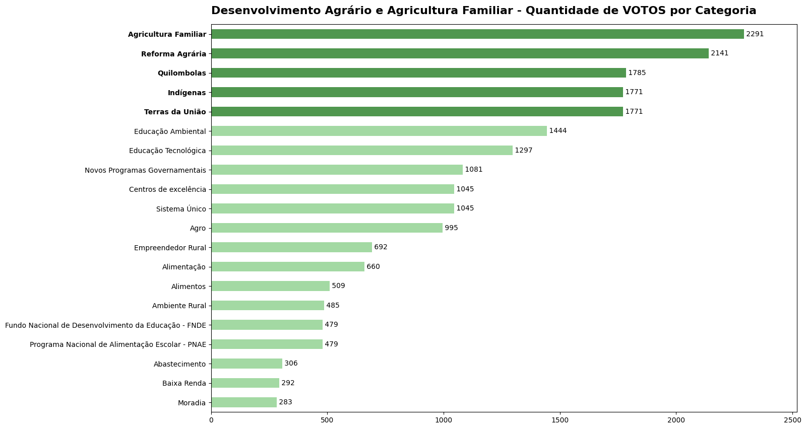

  <i>Gráfico 50: Desenvolvimento Agrário e Agricultura Familiar - Quantidade de VOTOS por Categoria</i>

Este gráfico de barras mostra a quantidade de votos por categoria para o ministério Desenvolvimento Agrário e Agricultura Familiar, exibindo as categorias com mais votos.

### Direitos Humanos e Cidadania - Quantidade de VOTOS por Categoria

  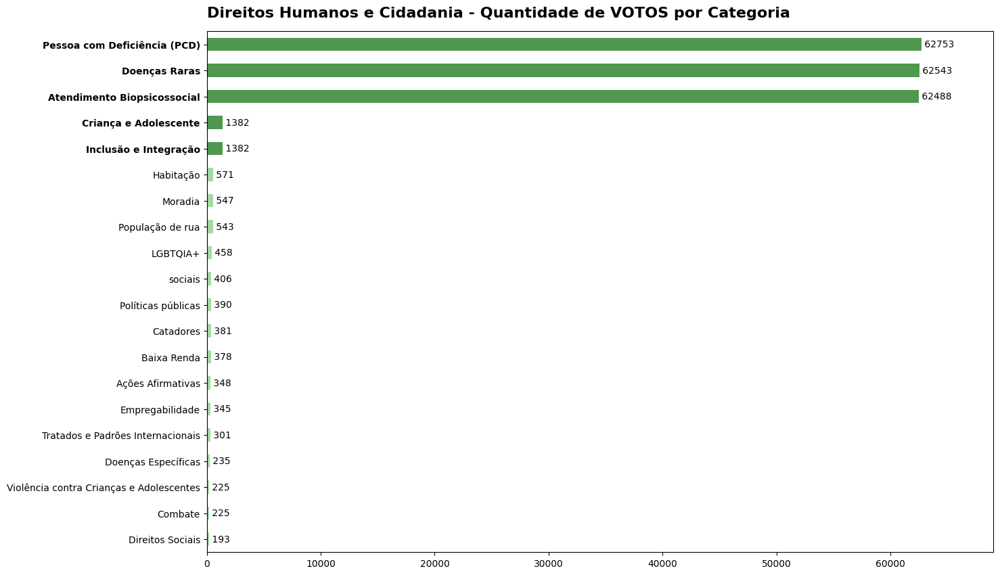

  <i>Gráfico 51: Direitos Humanos e Cidadania - Quantidade de VOTOS por Categoria</i>

Este gráfico de barras mostra a quantidade de votos por categoria para o ministério Direitos Humanos e Cidadania, exibindo as categorias com mais votos.

### Gestão e Inovação em Serviços Públicos - Quantidade de VOTOS por Categoria

  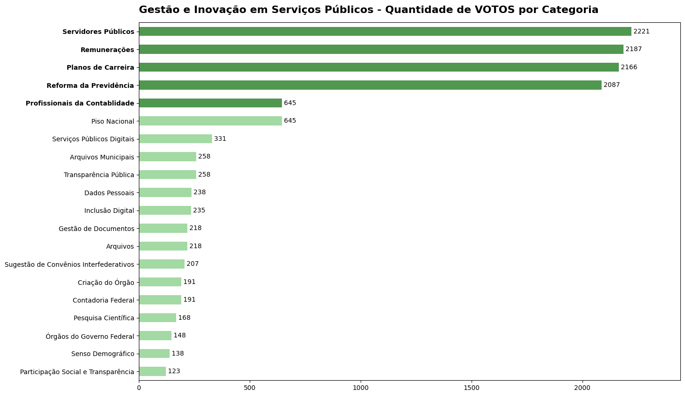

  <i>Gráfico 52: Gestão e Inovação em Serviços Públicos - Quantidade de VOTOS por Categoria</i>

Este gráfico de barras mostra a quantidade de votos por categoria para o ministério Gestão e Inovação em Serviços Públicos, exibindo as categorias com mais votos.

### Justiça e Segurança Pública - Quantidade de VOTOS por Categoria

  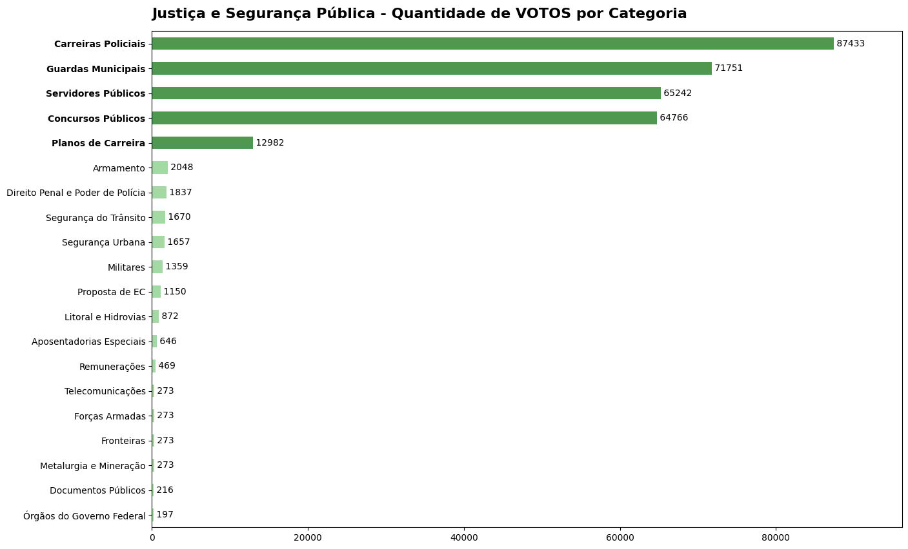

  <i>Gráfico 53: Justiça e Segurança Pública - Quantidade de VOTOS por Categoria</i>

Este gráfico de barras mostra a quantidade de votos por categoria para o ministério Justiça e Segurança Pública, exibindo as categorias com mais votos.

### Banco Central - Quantidade de VOTOS por Categoria

  

  <i>Gráfico 54: Banco Central - Quantidade de VOTOS por Categoria</i>

Este gráfico de barras mostra a quantidade de votos por categoria para o ministério Banco Central, exibindo as categorias com mais votos.

### Meio Ambiente e Mudança do Clima - Quantidade de VOTOS por Categoria

  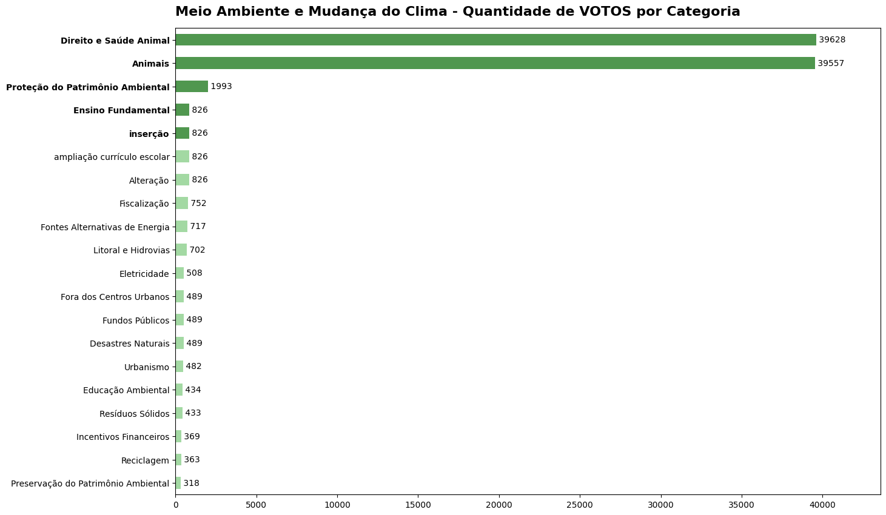

  <i>Gráfico 55: Meio Ambiente e Mudança do Clima - Quantidade de VOTOS por Categoria</i>

Este gráfico de barras mostra a quantidade de votos por categoria para o ministério Meio Ambiente e Mudança do Clima, exibindo as categorias com mais votos.

### Turismo - Quantidade de VOTOS por Categoria

  

  <i>Gráfico 56: Turismo - Quantidade de VOTOS por Categoria</i>

Este gráfico de barras mostra a quantidade de votos por categoria para o ministério Turismo, exibindo as categorias com mais votos.

### Mulheres - Quantidade de VOTOS por Categoria

  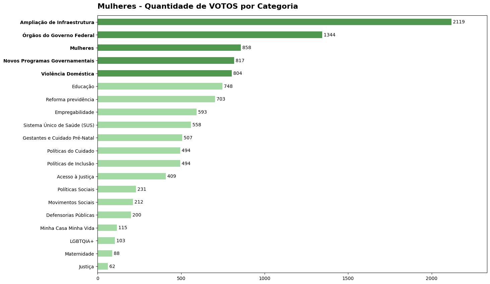

  <i>Gráfico 57: Mulheres - Quantidade de VOTOS por Categoria</i>

Este gráfico de barras mostra a quantidade de votos por categoria para o ministério Mulheres, exibindo as categorias com mais votos.

### Trabalho e Emprego - Quantidade de VOTOS por Categoria

  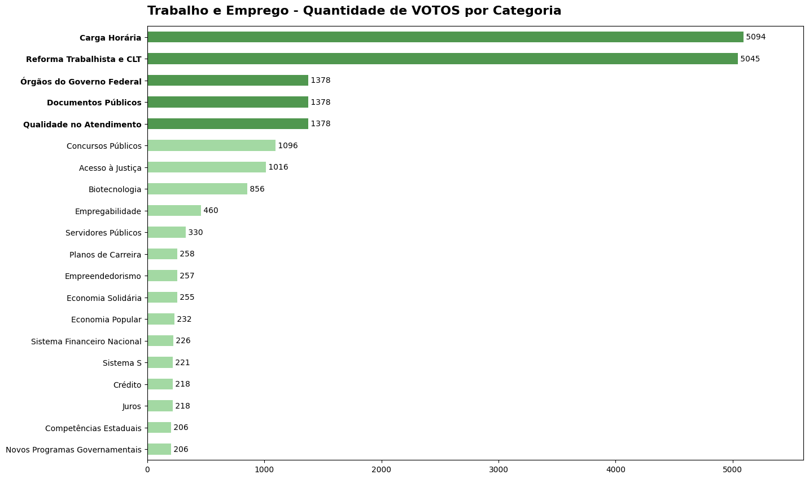

  <i>Gráfico 58: Trabalho e Emprego - Quantidade de VOTOS por Categoria</i>

Este gráfico de barras mostra a quantidade de votos por categoria para o ministério Trabalho e Emprego, exibindo as categorias com mais votos.

### Secretaria Geral da Presidência da República - Quantidade de VOTOS por Categoria

  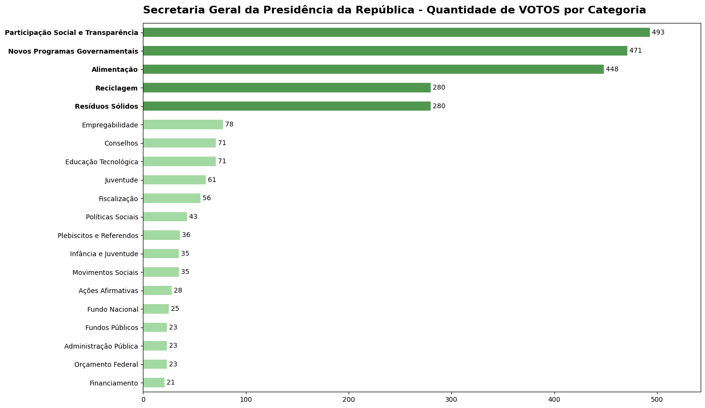

  <i>Gráfico 59: Secretaria Geral da Presidência da República - Quantidade de VOTOS por Categoria</i>

Este gráfico de barras mostra a quantidade de votos por categoria para o ministério Secretaria Geral da Presidência da República, exibindo as categorias com mais votos.

### Previdência Social - Quantidade de VOTOS por Categoria

  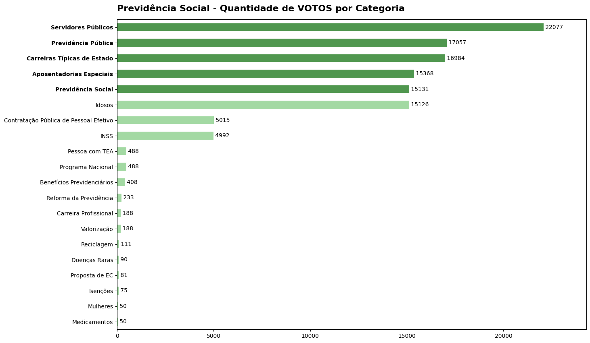

  <i>Gráfico 60: Previdência Social - Quantidade de VOTOS por Categoria</i>

Este gráfico de barras mostra a quantidade de votos por categoria para o ministério Previdência Social, exibindo as categorias com mais votos.

### Casa Civil - Quantidade de VOTOS por Categoria

  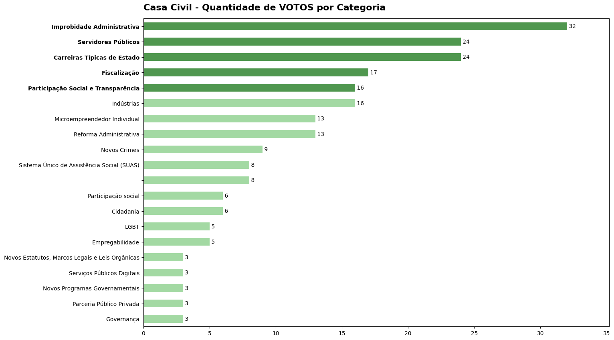

  <i>Gráfico 61: Casa Civil - Quantidade de VOTOS por Categoria</i>

Este gráfico de barras mostra a quantidade de votos por categoria para o ministério Casa Civil, exibindo as categorias com mais votos.

### Cidades - Quantidade de VOTOS por Categoria

  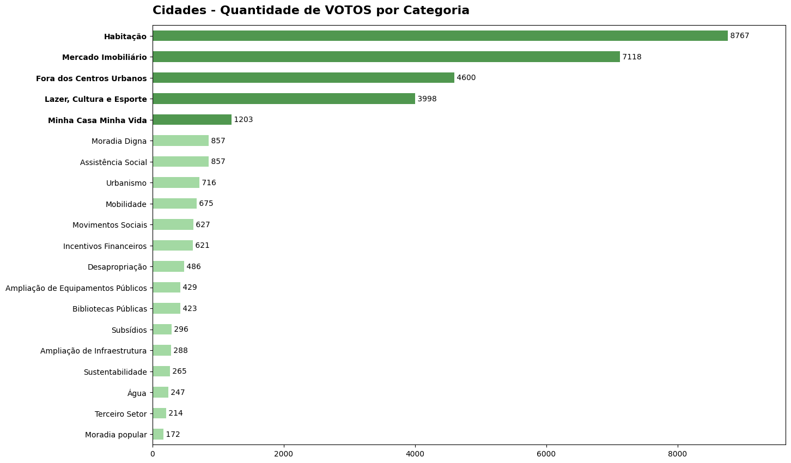

  <i>Gráfico 62: Cidades - Quantidade de VOTOS por Categoria</i>

Este gráfico de barras mostra a quantidade de votos por categoria para o ministério Cidades, exibindo as categorias com mais votos.

### Igualdade Racial - Quantidade de VOTOS por Categoria

  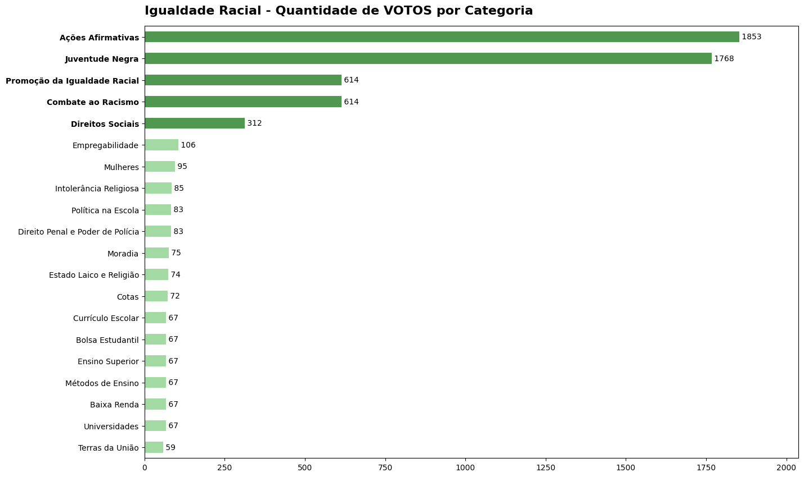

  <i>Gráfico 63: Igualdade Racial - Quantidade de VOTOS por Categoria</i>

Este gráfico de barras mostra a quantidade de votos por categoria para o ministério Igualdade Racial, exibindo as categorias com mais votos.

### Desenvolvimento, Indústria, Comércio e Serviços - Quantidade de VOTOS por Categoria

  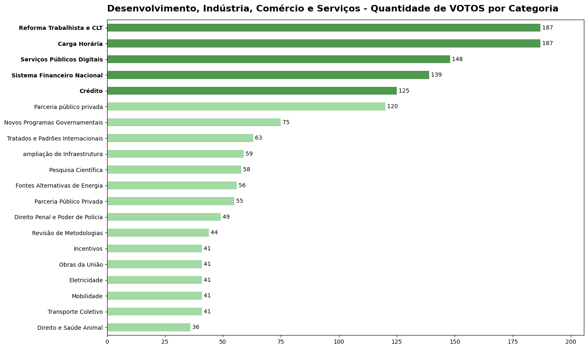

  <i>Gráfico 64: Desenvolvimento, Indústria, Comércio e Serviços - Quantidade de VOTOS por Categoria</i>

Este gráfico de barras mostra a quantidade de votos por categoria para o ministério Desenvolvimento, Indústria, Comércio e Serviços, exibindo as categorias com mais votos.

### Povos Indígenas - Quantidade de VOTOS por Categoria

  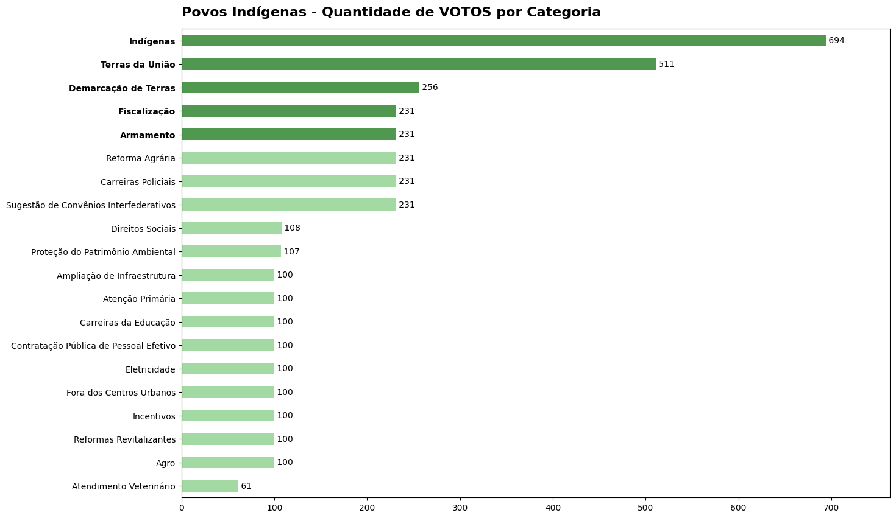

  <i>Gráfico 65: Povos Indígenas - Quantidade de VOTOS por Categoria</i>

Este gráfico de barras mostra a quantidade de votos por categoria para o ministério Povos Indígenas, exibindo as categorias com mais votos.

### Portos e Aeroportos - Quantidade de VOTOS por Categoria

  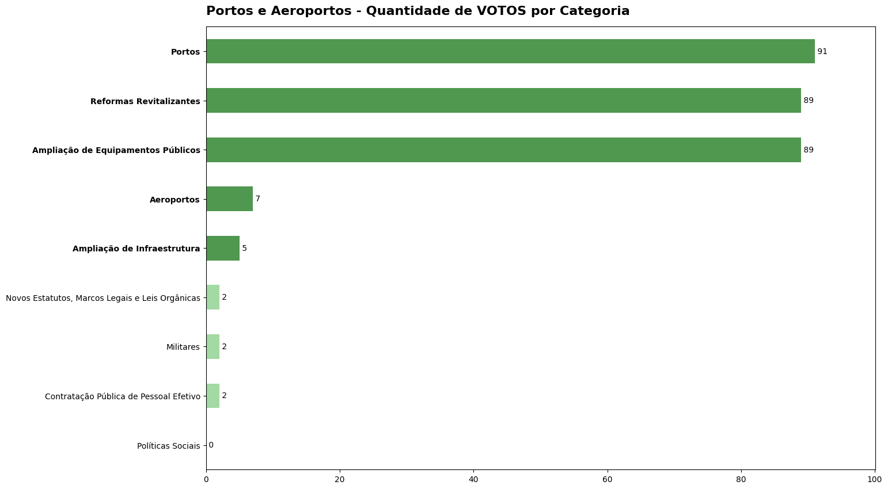

  <i>Gráfico 66: Portos e Aeroportos - Quantidade de VOTOS por Categoria</i>

Este gráfico de barras mostra a quantidade de votos por categoria para o ministério Portos e Aeroportos, exibindo as categorias com mais votos.

### Transportes - Quantidade de VOTOS por Categoria

  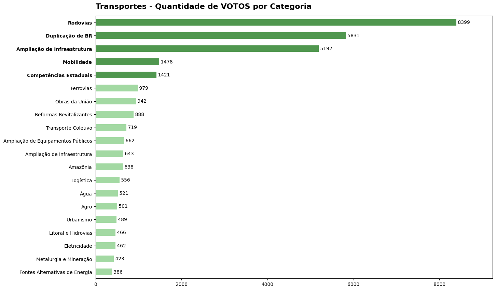

  <i>Gráfico 67: Transportes - Quantidade de VOTOS por Categoria</i>

Este gráfico de barras mostra a quantidade de votos por categoria para o ministério Transportes, exibindo as categorias com mais votos.

### Cultura - Quantidade de VOTOS por Categoria

  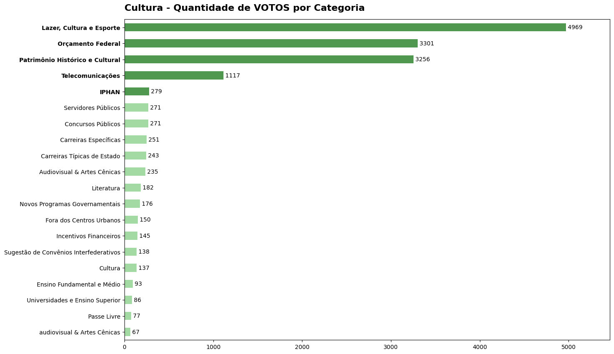

  <i>Gráfico 68: Cultura - Quantidade de VOTOS por Categoria</i>

Este gráfico de barras mostra a quantidade de votos por categoria para o ministério Cultura, exibindo as categorias com mais votos.

### Minas e Energia - Quantidade de VOTOS por Categoria

  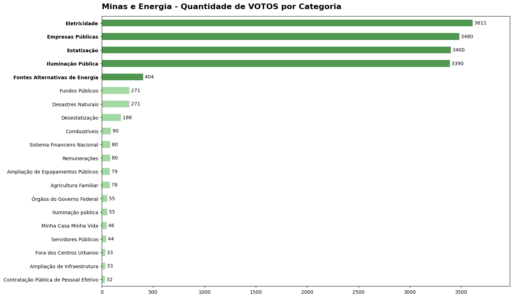

  <i>Gráfico 69: Minas e Energia - Quantidade de VOTOS por Categoria</i>

Este gráfico de barras mostra a quantidade de votos por categoria para o ministério Minas e Energia, exibindo as categorias com mais votos.

### Controladoria-Geral da União - Quantidade de VOTOS por Categoria

  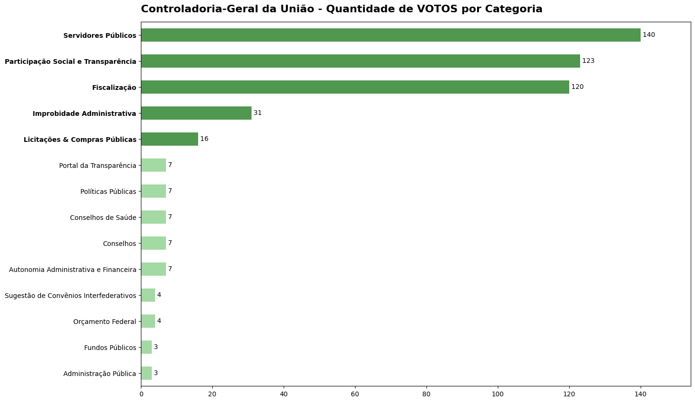

  <i>Gráfico 70: Controladoria-Geral da União - Quantidade de VOTOS por Categoria</i>

Este gráfico de barras mostra a quantidade de votos por categoria para o ministério Controladoria-Geral da União, exibindo as categorias com mais votos.

### Planejamento e Orçamento - Quantidade de VOTOS por Categoria

  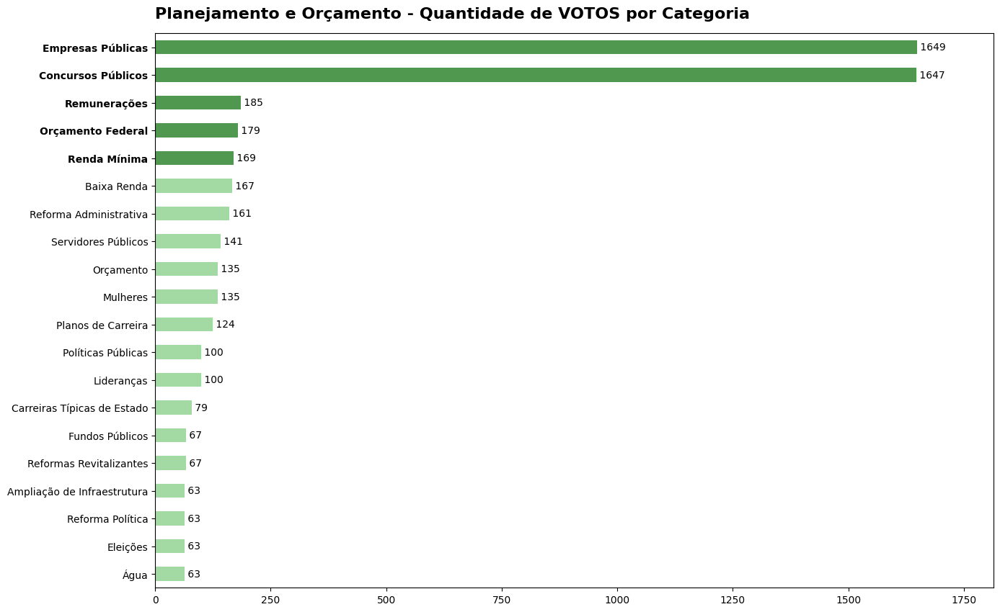

  <i>Gráfico 71: Planejamento e Orçamento - Quantidade de VOTOS por Categoria</i>

Este gráfico de barras mostra a quantidade de votos por categoria para o ministério Planejamento e Orçamento, exibindo as categorias com mais votos.

### Fazenda - Quantidade de VOTOS por Categoria

  

  <i>Gráfico 72: Fazenda - Quantidade de VOTOS por Categoria</i>

Este gráfico de barras mostra a quantidade de votos por categoria para o ministério Fazenda, exibindo as categorias com mais votos.

### Comunicação Social - Quantidade de VOTOS por Categoria

  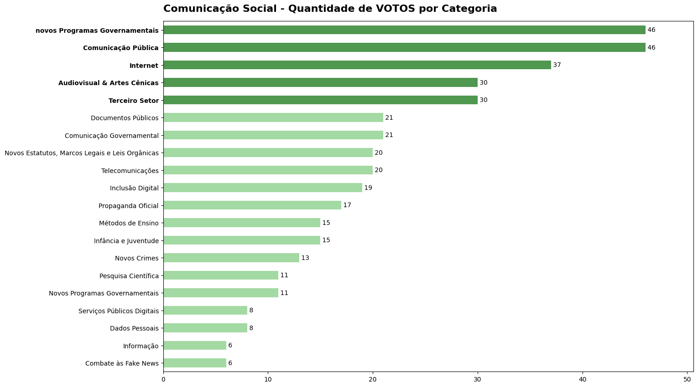

  <i>Gráfico 73: Comunicação Social - Quantidade de VOTOS por Categoria</i>

Este gráfico de barras mostra a quantidade de votos por categoria para o ministério Comunicação Social, exibindo as categorias com mais votos.

### Esporte - Quantidade de VOTOS por Categoria

  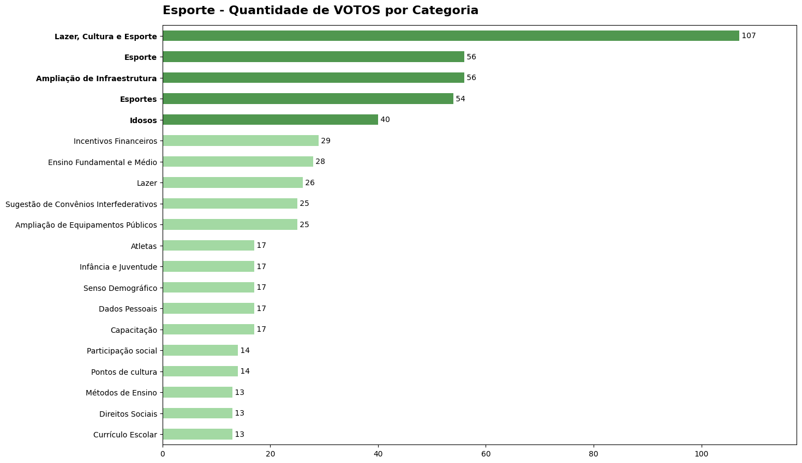

  <i>Gráfico 74: Esporte - Quantidade de VOTOS por Categoria</i>

Este gráfico de barras mostra a quantidade de votos por categoria para o ministério Esporte, exibindo as categorias com mais votos.

### Pesca e Aquicultura - Quantidade de VOTOS por Categoria

  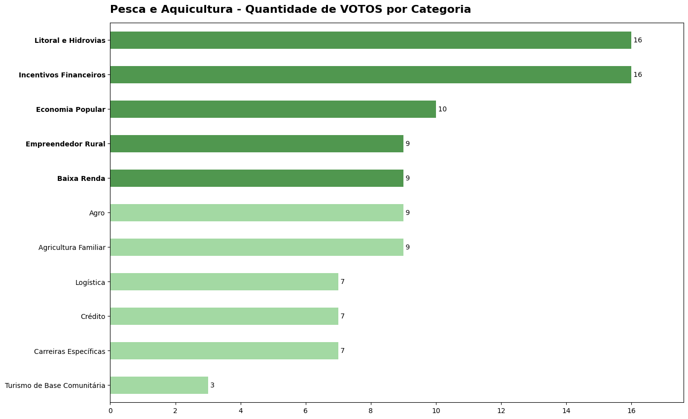

  <i>Gráfico 75: Pesca e Aquicultura - Quantidade de VOTOS por Categoria</i>

Este gráfico de barras mostra a quantidade de votos por categoria para o ministério Pesca e Aquicultura, exibindo as categorias com mais votos.

### Relações Exteriores - Quantidade de VOTOS por Categoria

  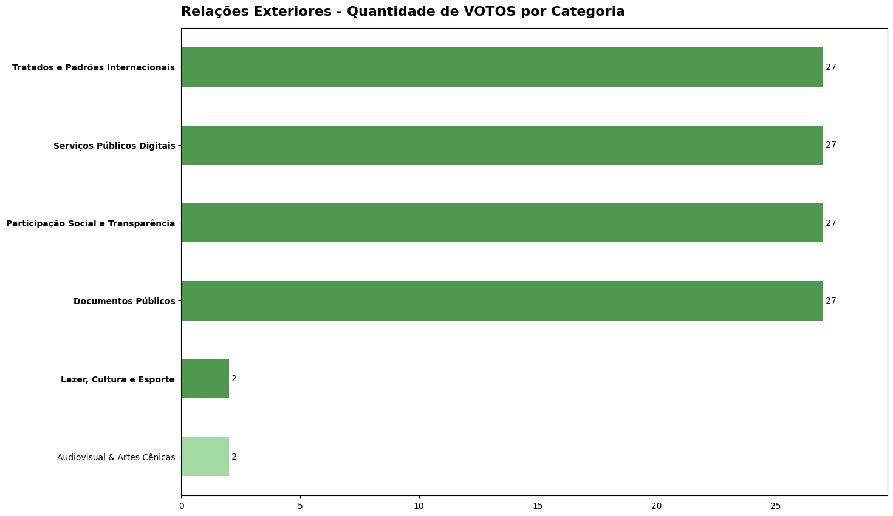

  <i>Gráfico 76: Relações Exteriores - Quantidade de VOTOS por Categoria</i>

Este gráfico de barras mostra a quantidade de votos por categoria para o ministério Relações Exteriores, exibindo as categorias com mais votos.

### Defesa - Quantidade de VOTOS por Categoria

  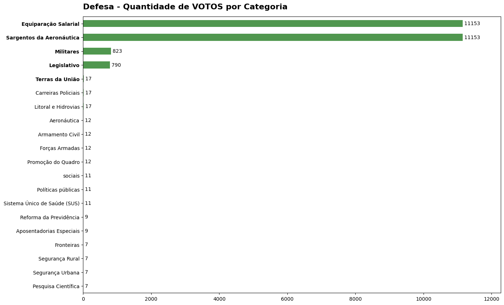

  <i>Gráfico 77: Defesa - Quantidade de VOTOS por Categoria</i>

Este gráfico de barras mostra a quantidade de votos por categoria para o ministério Defesa, exibindo as categorias com mais votos.

### Segurança Institucional - Quantidade de VOTOS por Categoria

  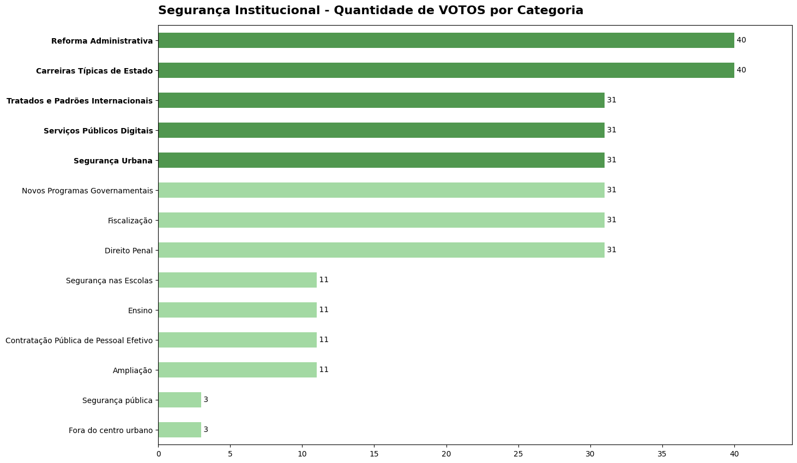

  <i>Gráfico 78: Segurança Institucional - Quantidade de VOTOS por Categoria</i>

Este gráfico de barras mostra a quantidade de votos por categoria para o ministério Segurança Institucional, exibindo as categorias com mais votos.

### Relações Institucionais - Quantidade de VOTOS por Categoria

  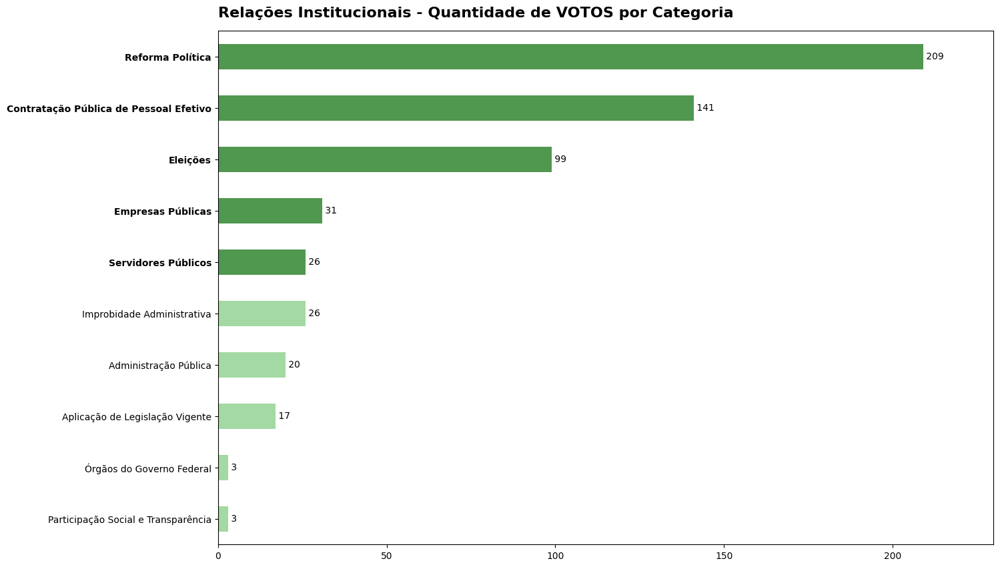

  <i>Gráfico 79: Relações Institucionais - Quantidade de VOTOS por Categoria</i>

Este gráfico de barras mostra a quantidade de votos por categoria para o ministério Relações Institucionais, exibindo as categorias com mais votos.

### Ciência, Tecnologia e Inovação - Quantidade de PROPOSTAS por Categoria

  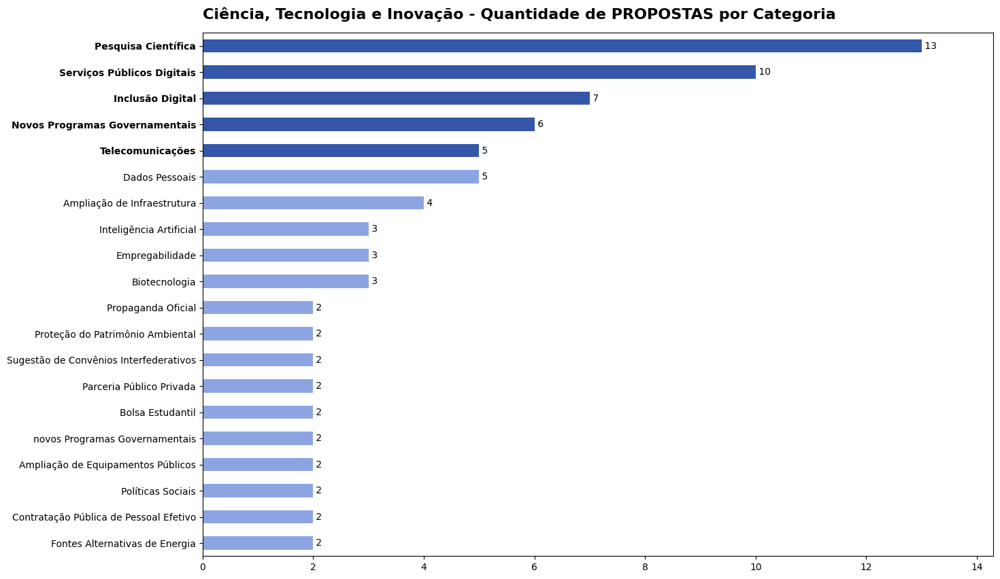

  <i>Gráfico 80: Ciência, Tecnologia e Inovação - Quantidade de PROPOSTAS por Categoria</i>

Este gráfico de barras mostra a quantidade de propostas por categoria para o ministério Ciência, Tecnologia e Inovação, exibindo as categorias com mais propostas.

### Saúde - Quantidade de PROPOSTAS por Categoria

  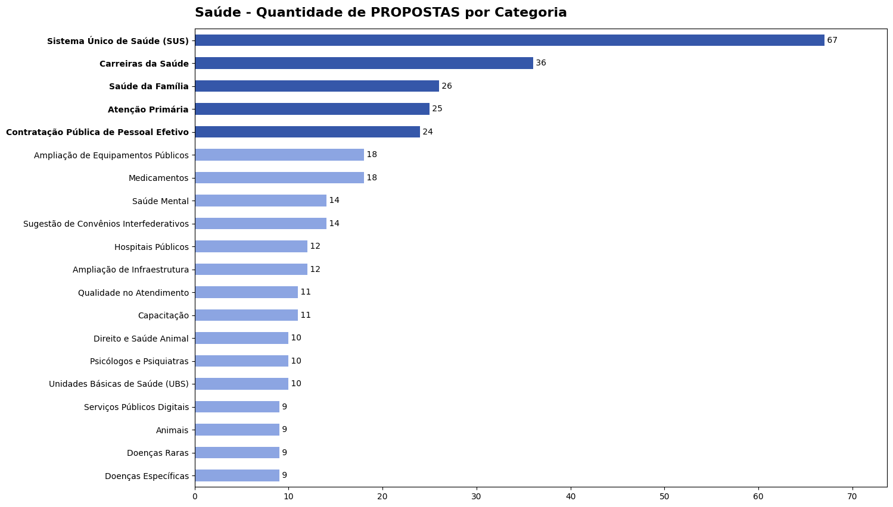

  <i>Gráfico 81: Saúde - Quantidade de PROPOSTAS por Categoria</i>

Este gráfico de barras mostra a quantidade de propostas por categoria para o ministério Saúde, exibindo as categorias com mais propostas.

### Desenvolvimento e Assistência Social, Família e Combate à Fome - Quantidade de PROPOSTAS por Categoria

  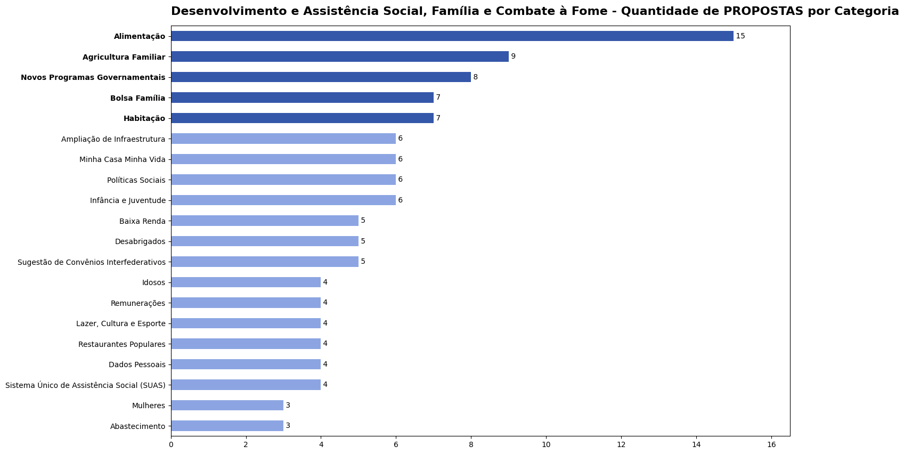

  <i>Gráfico 82: Desenvolvimento e Assistência Social, Família e Combate à Fome - Quantidade de PROPOSTAS por Categoria</i>

Este gráfico de barras mostra a quantidade de propostas por categoria para o ministério Desenvolvimento e Assistência Social, Família e Combate à Fome, exibindo as categorias com mais propostas.

### Comunicações - Quantidade de PROPOSTAS por Categoria

  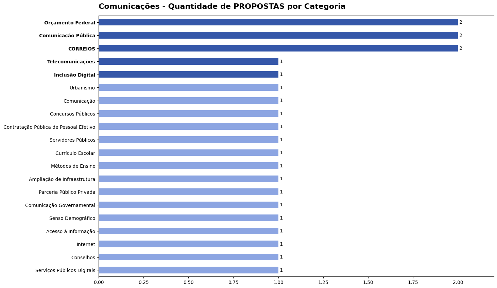

  <i>Gráfico 83: Comunicações - Quantidade de PROPOSTAS por Categoria</i>

Este gráfico de barras mostra a quantidade de propostas por categoria para o ministério Comunicações, exibindo as categorias com mais propostas.

### Agricultura e Pecuária - Quantidade de PROPOSTAS por Categoria

  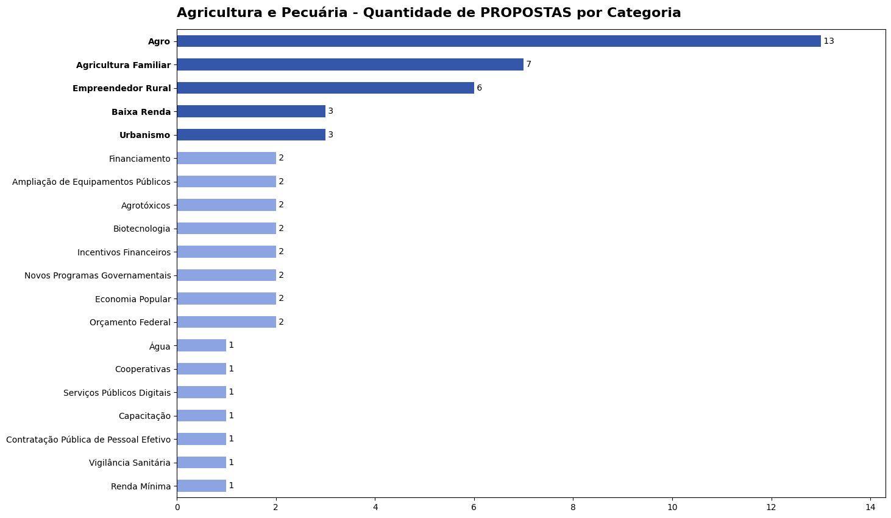

  <i>Gráfico 84: Agricultura e Pecuária - Quantidade de PROPOSTAS por Categoria</i>

Este gráfico de barras mostra a quantidade de propostas por categoria para o ministério Agricultura e Pecuária, exibindo as categorias com mais propostas.

### Educação - Quantidade de PROPOSTAS por Categoria

  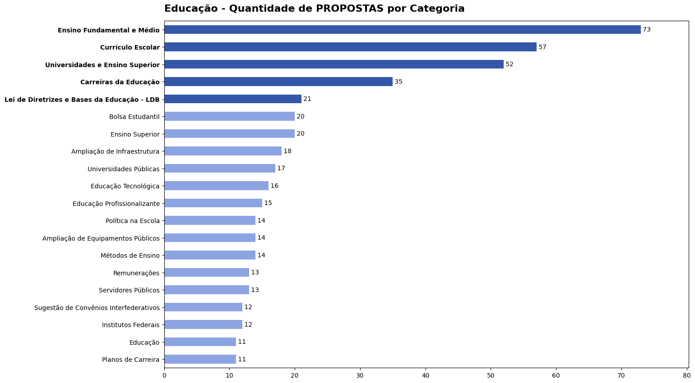

  <i>Gráfico 85: Educação - Quantidade de PROPOSTAS por Categoria</i>

Este gráfico de barras mostra a quantidade de propostas por categoria para o ministério Educação, exibindo as categorias com mais propostas.

### Integração e Desenvolvimento Regional - Quantidade de PROPOSTAS por Categoria

  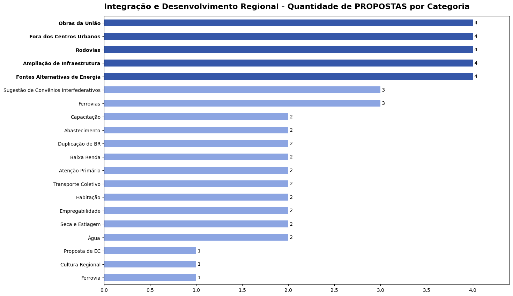

  <i>Gráfico 86: Integração e Desenvolvimento Regional - Quantidade de PROPOSTAS por Categoria</i>

Este gráfico de barras mostra a quantidade de propostas por categoria para o ministério Integração e Desenvolvimento Regional, exibindo as categorias com mais propostas.

### Desenvolvimento Agrário e Agricultura Familiar - Quantidade de PROPOSTAS por Categoria

  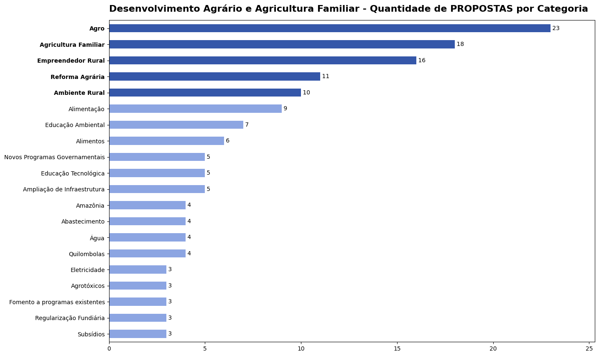

  <i>Gráfico 87: Desenvolvimento Agrário e Agricultura Familiar - Quantidade de PROPOSTAS por Categoria</i>

Este gráfico de barras mostra a quantidade de propostas por categoria para o ministério Desenvolvimento Agrário e Agricultura Familiar, exibindo as categorias com mais propostas.

### Direitos Humanos e Cidadania - Quantidade de PROPOSTAS por Categoria

  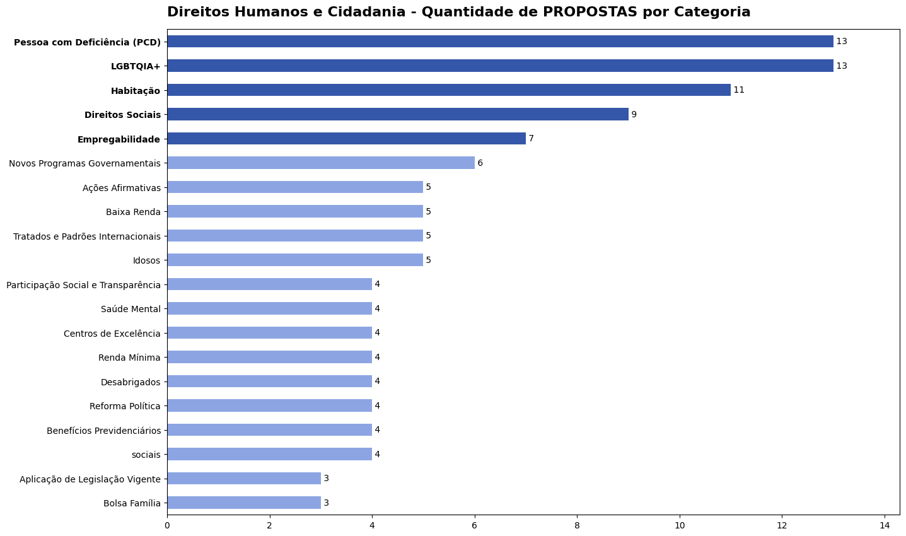

  <i>Gráfico 88: Direitos Humanos e Cidadania - Quantidade de PROPOSTAS por Categoria</i>

Este gráfico de barras mostra a quantidade de propostas por categoria para o ministério Direitos Humanos e Cidadania, exibindo as categorias com mais propostas.

### Gestão e Inovação em Serviços Públicos - Quantidade de PROPOSTAS por Categoria

  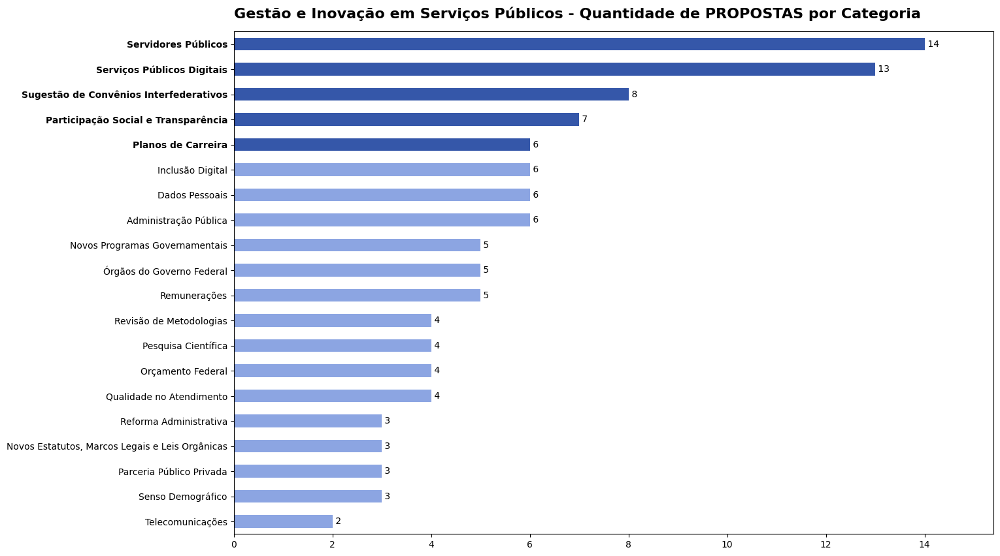

  <i>Gráfico 89: Gestão e Inovação em Serviços Públicos - Quantidade de PROPOSTAS por Categoria</i>

Este gráfico de barras mostra a quantidade de propostas por categoria para o ministério Gestão e Inovação em Serviços Públicos, exibindo as categorias com mais propostas.

### Justiça e Segurança Pública - Quantidade de PROPOSTAS por Categoria

  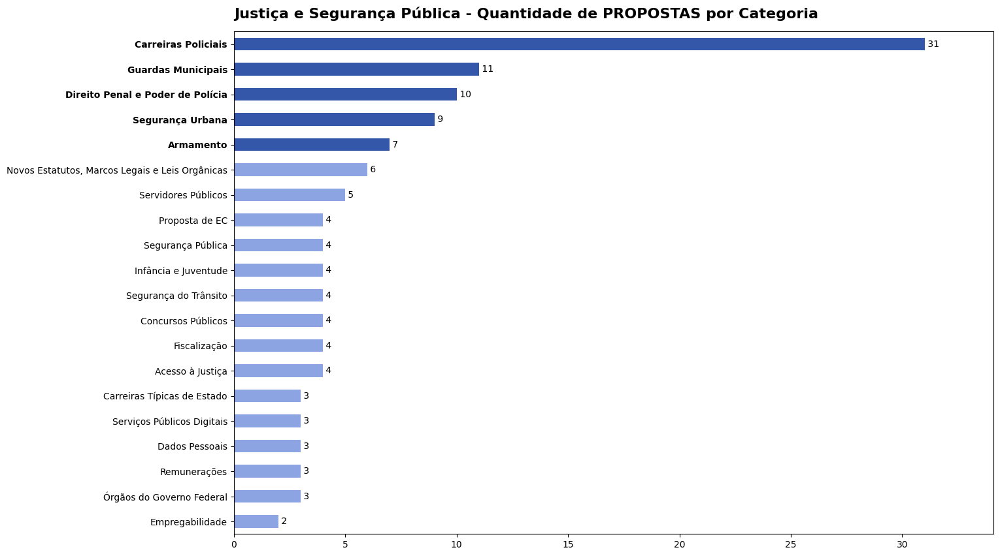

  <i>Gráfico 90: Justiça e Segurança Pública - Quantidade de PROPOSTAS por Categoria</i>

Este gráfico de barras mostra a quantidade de propostas por categoria para o ministério Justiça e Segurança Pública, exibindo as categorias com mais propostas.

### Banco Central - Quantidade de PROPOSTAS por Categoria

  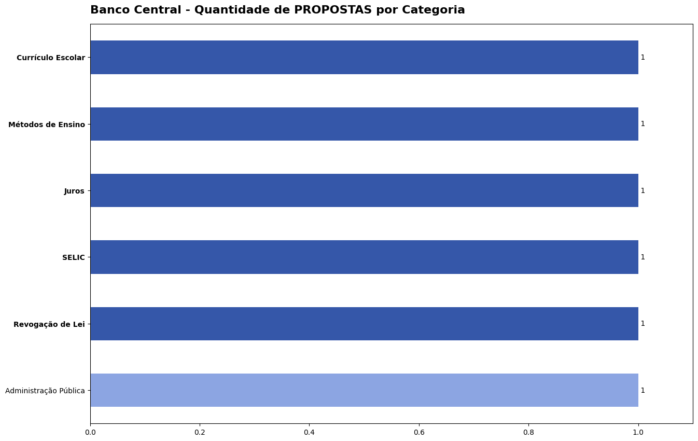

  <i>Gráfico 91: Banco Central - Quantidade de PROPOSTAS por Categoria</i>

Este gráfico de barras mostra a quantidade de propostas por categoria para o ministério Banco Central, exibindo as categorias com mais propostas.

### Meio Ambiente e Mudança do Clima - Quantidade de PROPOSTAS por Categoria

  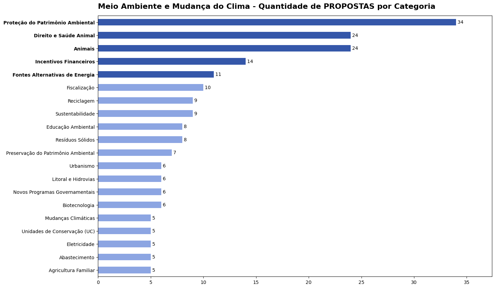

  <i>Gráfico 92: Meio Ambiente e Mudança do Clima - Quantidade de PROPOSTAS por Categoria</i>

Este gráfico de barras mostra a quantidade de propostas por categoria para o ministério Meio Ambiente e Mudança do Clima, exibindo as categorias com mais propostas.

### Turismo - Quantidade de PROPOSTAS por Categoria

  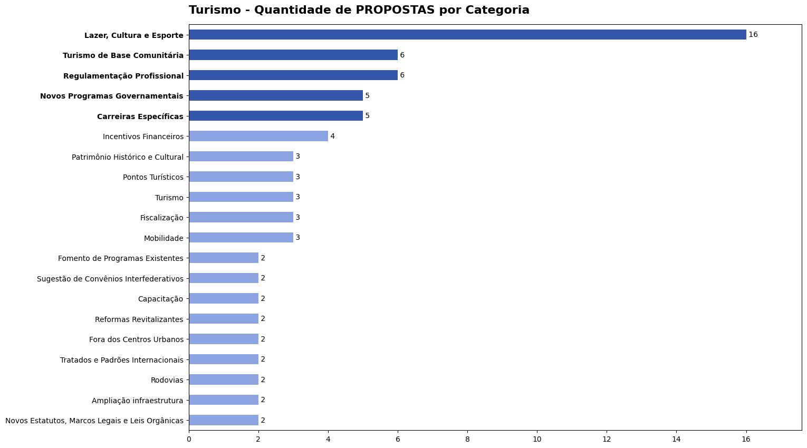

  <i>Gráfico 93: Turismo - Quantidade de PROPOSTAS por Categoria</i>

Este gráfico de barras mostra a quantidade de propostas por categoria para o ministério Turismo, exibindo as categorias com mais propostas.

### Mulheres - Quantidade de PROPOSTAS por Categoria

  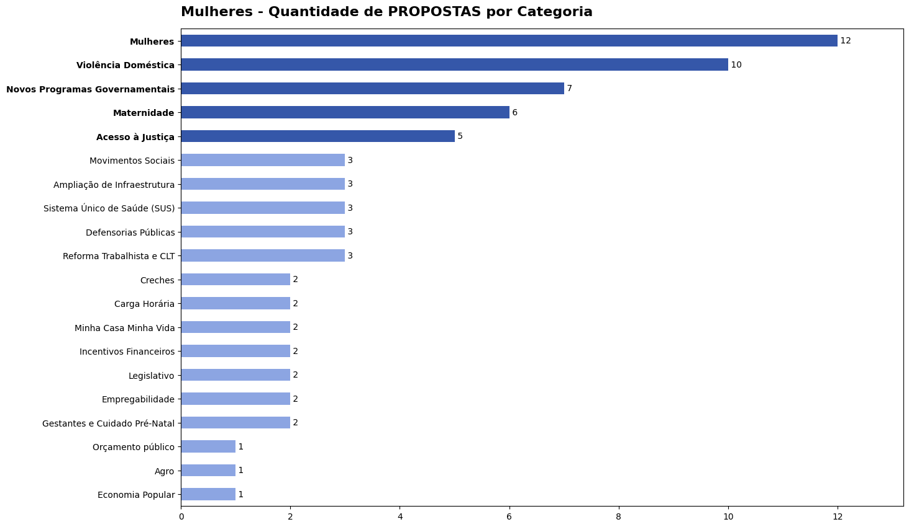

  <i>Gráfico 94: Mulheres - Quantidade de PROPOSTAS por Categoria</i>

Este gráfico de barras mostra a quantidade de propostas por categoria para o ministério Mulheres, exibindo as categorias com mais propostas.

### Trabalho e Emprego - Quantidade de PROPOSTAS por Categoria

  

  <i>Gráfico 95: Trabalho e Emprego - Quantidade de PROPOSTAS por Categoria</i>

Este gráfico de barras mostra a quantidade de propostas por categoria para o ministério Trabalho e Emprego, exibindo as categorias com mais propostas.

### Secretaria Geral da Presidência da República - Quantidade de PROPOSTAS por Categoria

  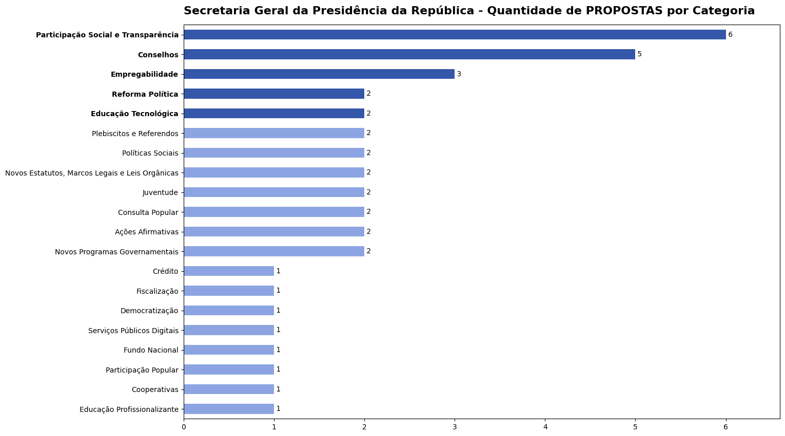

  <i>Gráfico 96: Secretaria Geral da Presidência da República - Quantidade de PROPOSTAS por Categoria</i>

Este gráfico de barras mostra a quantidade de propostas por categoria para o ministério Secretaria Geral da Presidência da República, exibindo as categorias com mais propostas.

### Previdência Social - Quantidade de PROPOSTAS por Categoria

  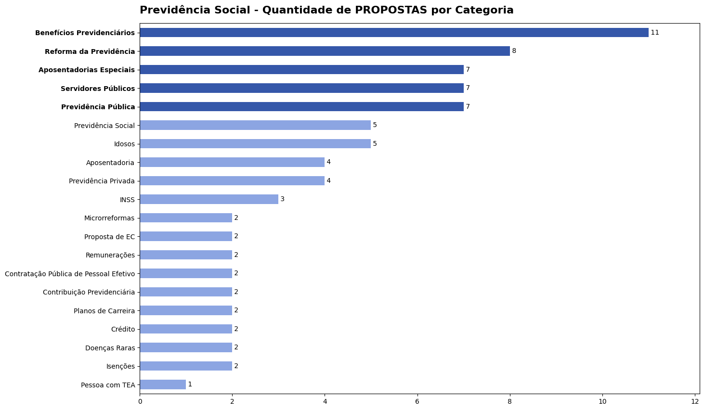

  <i>Gráfico 97: Previdência Social - Quantidade de PROPOSTAS por Categoria</i>

Este gráfico de barras mostra a quantidade de propostas por categoria para o ministério Previdência Social, exibindo as categorias com mais propostas.

### Casa Civil - Quantidade de PROPOSTAS por Categoria

  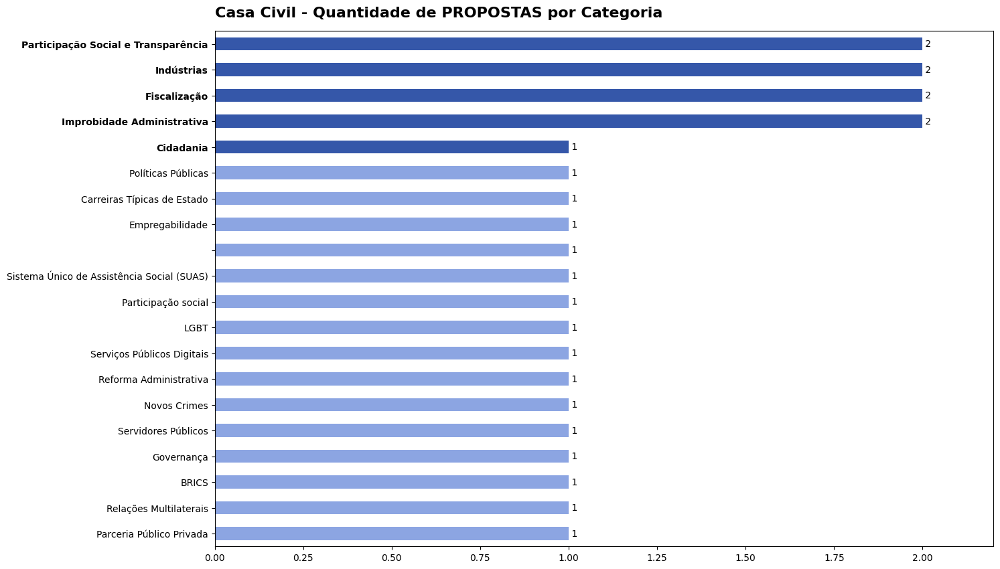

  <i>Gráfico 98: Casa Civil - Quantidade de PROPOSTAS por Categoria</i>

Este gráfico de barras mostra a quantidade de propostas por categoria para o ministério Casa Civil, exibindo as categorias com mais propostas.

### Cidades - Quantidade de PROPOSTAS por Categoria

  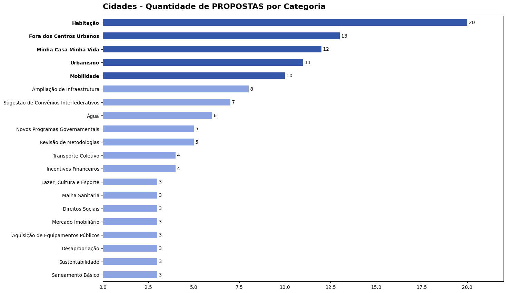

  <i>Gráfico 99: Cidades - Quantidade de PROPOSTAS por Categoria</i>

Este gráfico de barras mostra a quantidade de propostas por categoria para o ministério Cidades, exibindo as categorias com mais propostas.

### Igualdade Racial - Quantidade de PROPOSTAS por Categoria

  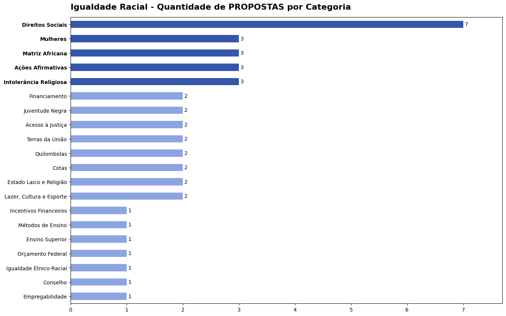

  <i>Gráfico 100: Igualdade Racial - Quantidade de PROPOSTAS por Categoria</i>

Este gráfico de barras mostra a quantidade de propostas por categoria para o ministério Igualdade Racial, exibindo as categorias com mais propostas.

### Desenvolvimento, Indústria, Comércio e Serviços - Quantidade de PROPOSTAS por Categoria

  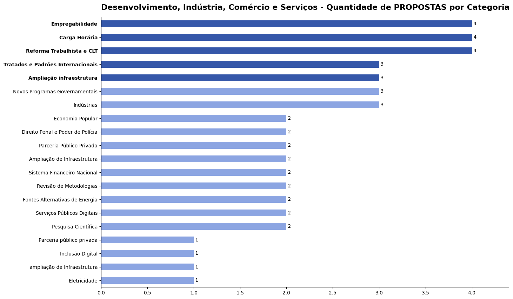

  <i>Gráfico 101: Desenvolvimento, Indústria, Comércio e Serviços - Quantidade de PROPOSTAS por Categoria</i>

Este gráfico de barras mostra a quantidade de propostas por categoria para o ministério Desenvolvimento, Indústria, Comércio e Serviços, exibindo as categorias com mais propostas.

### Povos Indígenas - Quantidade de PROPOSTAS por Categoria

  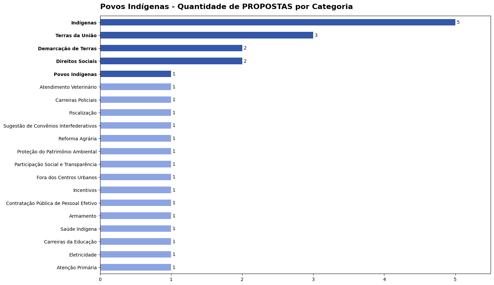

  <i>Gráfico 102: Povos Indígenas - Quantidade de PROPOSTAS por Categoria</i>

Este gráfico de barras mostra a quantidade de propostas por categoria para o ministério Povos Indígenas, exibindo as categorias com mais propostas.

### Portos e Aeroportos - Quantidade de PROPOSTAS por Categoria

  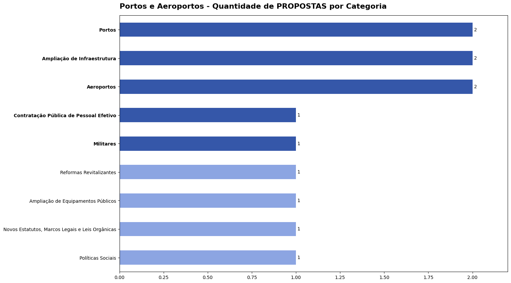

  <i>Gráfico 103: Portos e Aeroportos - Quantidade de PROPOSTAS por Categoria</i>

Este gráfico de barras mostra a quantidade de propostas por categoria para o ministério Portos e Aeroportos, exibindo as categorias com mais propostas.

### Transportes - Quantidade de PROPOSTAS por Categoria

  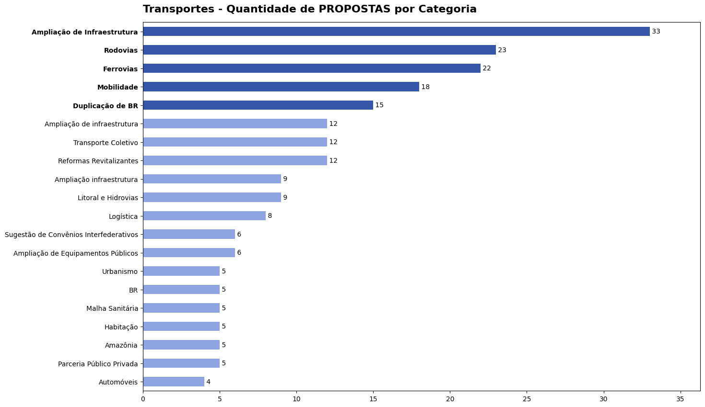

  <i>Gráfico 104: Transportes - Quantidade de PROPOSTAS por Categoria</i>

Este gráfico de barras mostra a quantidade de propostas por categoria para o ministério Transportes, exibindo as categorias com mais propostas.

### Cultura - Quantidade de PROPOSTAS por Categoria

  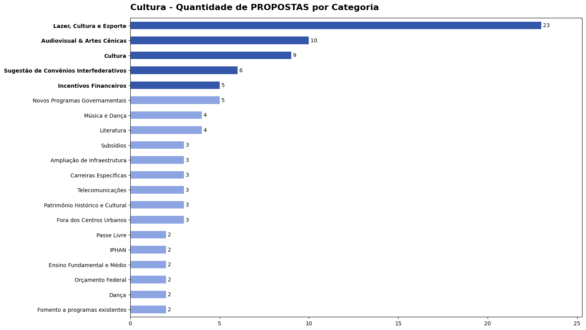

  <i>Gráfico 105: Cultura - Quantidade de PROPOSTAS por Categoria</i>

Este gráfico de barras mostra a quantidade de propostas por categoria para o ministério Cultura, exibindo as categorias com mais propostas.

### Minas e Energia - Quantidade de PROPOSTAS por Categoria

  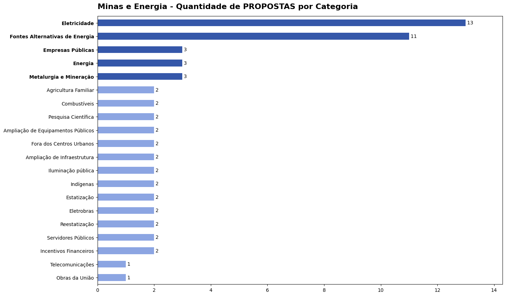

  <i>Gráfico 106: Minas e Energia - Quantidade de PROPOSTAS por Categoria</i>

Este gráfico de barras mostra a quantidade de propostas por categoria para o ministério Minas e Energia, exibindo as categorias com mais propostas.

### Controladoria-Geral da União - Quantidade de PROPOSTAS por Categoria

  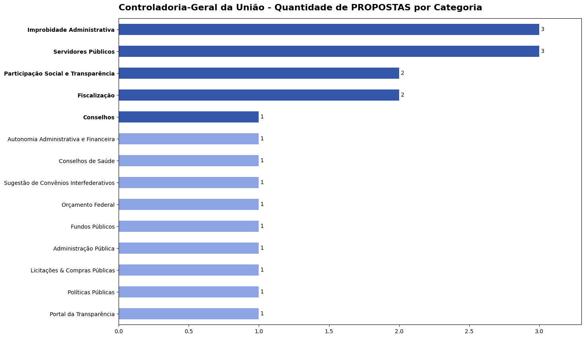

  <i>Gráfico 107: Controladoria-Geral da União - Quantidade de PROPOSTAS por Categoria</i>

Este gráfico de barras mostra a quantidade de propostas por categoria para o ministério Controladoria-Geral da União, exibindo as categorias com mais propostas.

### Planejamento e Orçamento - Quantidade de PROPOSTAS por Categoria

  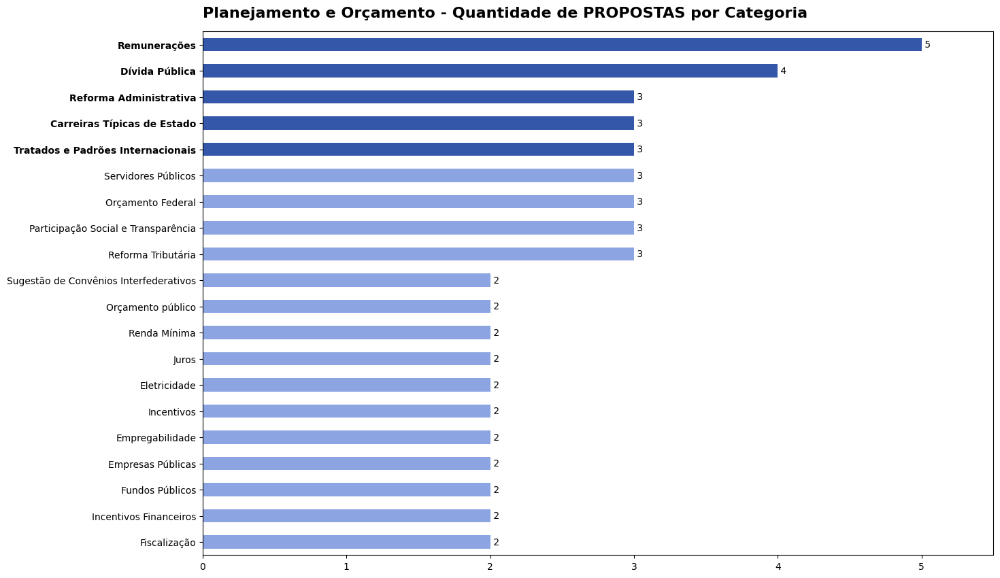

  <i>Gráfico 108: Planejamento e Orçamento - Quantidade de PROPOSTAS por Categoria</i>

Este gráfico de barras mostra a quantidade de propostas por categoria para o ministério Planejamento e Orçamento, exibindo as categorias com mais propostas.

### Fazenda - Quantidade de PROPOSTAS por Categoria

  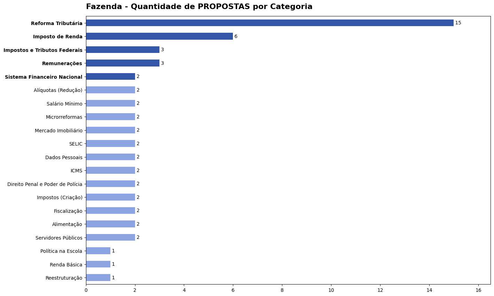

  <i>Gráfico 109: Fazenda - Quantidade de PROPOSTAS por Categoria</i>

Este gráfico de barras mostra a quantidade de propostas por categoria para o ministério Fazenda, exibindo as categorias com mais propostas.

### Comunicação Social - Quantidade de PROPOSTAS por Categoria

  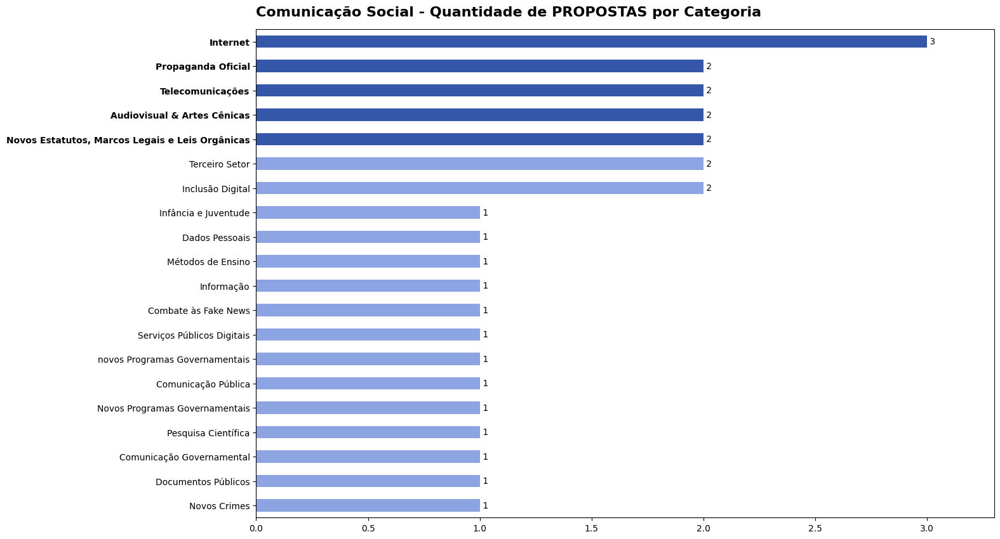

  <i>Gráfico 110: Comunicação Social - Quantidade de PROPOSTAS por Categoria</i>

Este gráfico de barras mostra a quantidade de propostas por categoria para o ministério Comunicação Social, exibindo as categorias com mais propostas.

### Esporte - Quantidade de PROPOSTAS por Categoria

  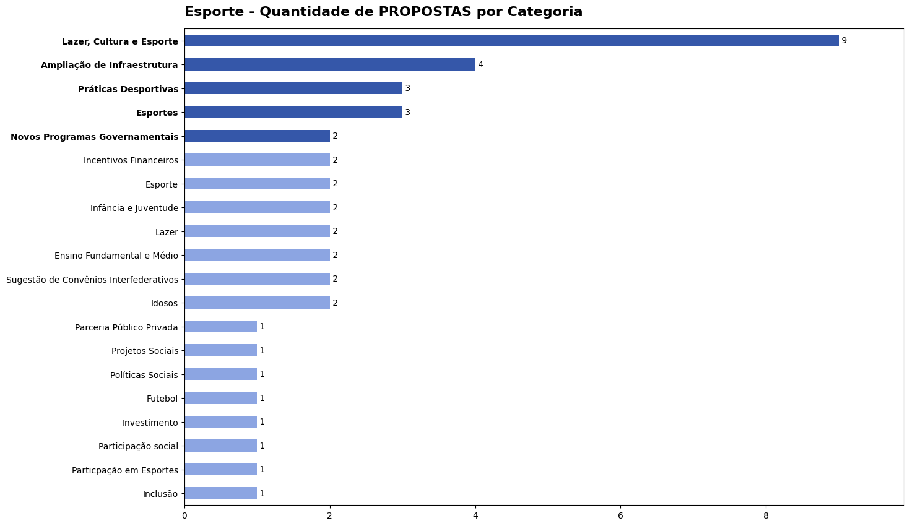

  <i>Gráfico 111: Esporte - Quantidade de PROPOSTAS por Categoria</i>

Este gráfico de barras mostra a quantidade de propostas por categoria para o ministério Esporte, exibindo as categorias com mais propostas.

### Pesca e Aquicultura - Quantidade de PROPOSTAS por Categoria

  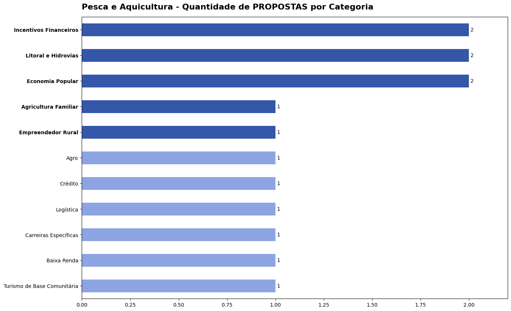

  <i>Gráfico 112: Pesca e Aquicultura - Quantidade de PROPOSTAS por Categoria</i>

Este gráfico de barras mostra a quantidade de propostas por categoria para o ministério Pesca e Aquicultura, exibindo as categorias com mais propostas.

### Relações Exteriores - Quantidade de PROPOSTAS por Categoria

  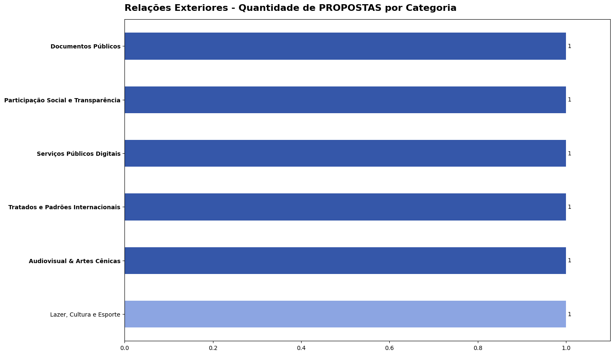

  <i>Gráfico 113: Relações Exteriores - Quantidade de PROPOSTAS por Categoria</i>

Este gráfico de barras mostra a quantidade de propostas por categoria para o ministério Relações Exteriores, exibindo as categorias com mais propostas.

### Defesa - Quantidade de PROPOSTAS por Categoria

  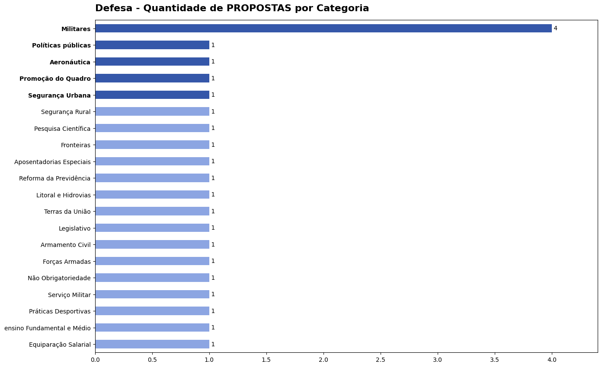

  <i>Gráfico 114: Defesa - Quantidade de PROPOSTAS por Categoria</i>

Este gráfico de barras mostra a quantidade de propostas por categoria para o ministério Defesa, exibindo as categorias com mais propostas.

### Segurança Institucional - Quantidade de PROPOSTAS por Categoria

  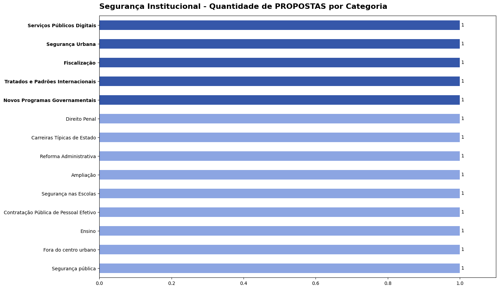

  <i>Gráfico 115: Segurança Institucional - Quantidade de PROPOSTAS por Categoria</i>

Este gráfico de barras mostra a quantidade de propostas por categoria para o ministério Segurança Institucional, exibindo as categorias com mais propostas.

### Relações Institucionais - Quantidade de PROPOSTAS por Categoria

  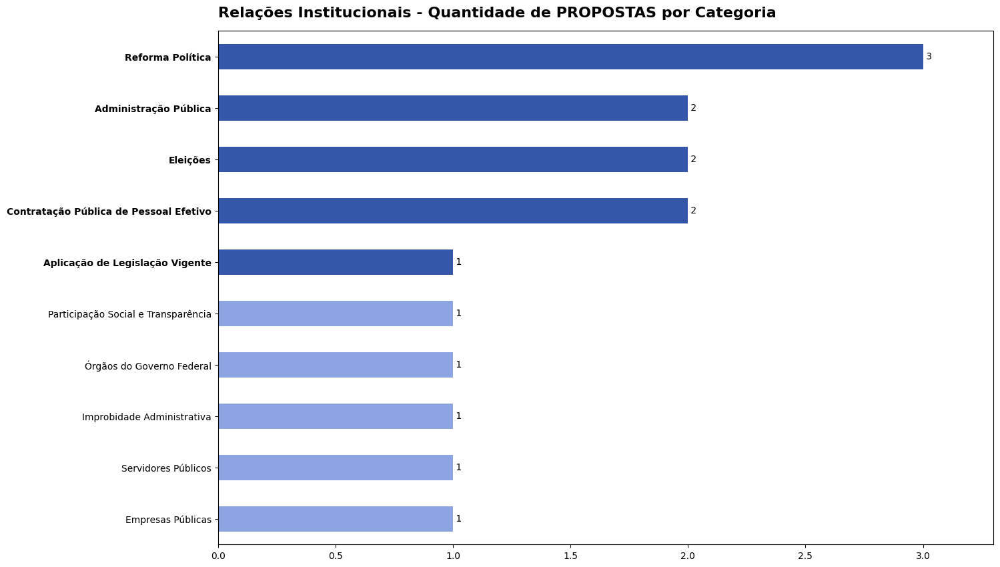

  <i>Gráfico 116: Relações Institucionais - Quantidade de PROPOSTAS por Categoria</i>

Este gráfico de barras mostra a quantidade de propostas por categoria para o ministério Relações Institucionais, exibindo as categorias com mais propostas.

